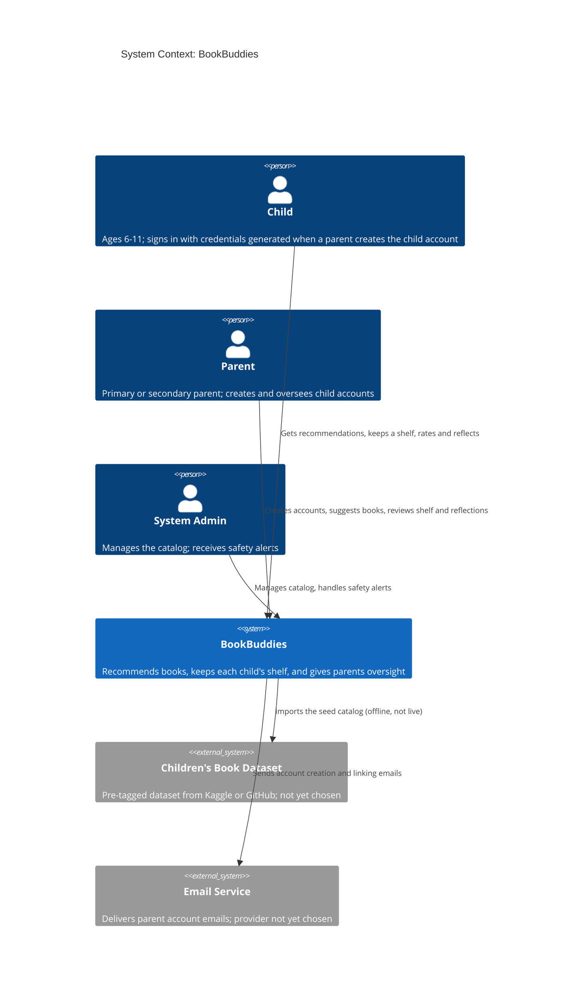
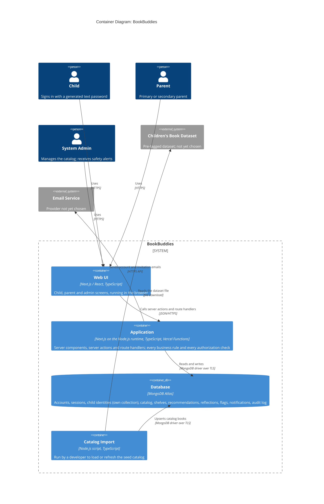

# Architectural Design

**Project:** BookBuddies
**Team:** Team 05
**Client:** Dr. Yang Yang, Research Scientist, IBR/Knight D Research
**Version:** 0.3

---

_**How to use this template.** Instructions appear in italic square brackets. Fill in underneath them and leave them in place until the document is stable. Every section says which checkpoint it is due at. A section that is not due yet stays as it is; do not fill it with guesses to make the document look finished._

_**What this document is.** Your system's **architecture-of-record**: the one map of the whole system, every use case area, every component, every external system, and the few decisions that are expensive to change later. It is **breadth-complete and depth-shallow**. Every part of the system is named, and nothing is designed further than its responsibility. How one use case works inside its component is a design-of-record, which comes in week 7, one per use case area, and it is written against real code._

_**What it is not.** A second copy of your requirements. The specification says what the system must do and how well; this document says how the system is shaped to do it. It **cites** `UC-*`, `CO-*`, `SEC-*`, `PER-*` and the rest by identifier and never restates them. A threshold that appears here and nowhere in the specification is a requirement hiding in the wrong document._

_**The test for what belongs here.** Decide now what is hard to reverse, affects the whole system, and is forced by a quality attribute or a constraint: how many deployables, where the data lives, how users sign in, which external systems you depend on. Leave to per-area design what is local and cheap to change: class names, endpoint shapes, table columns._

_**Structure.** The sections follow **arc42** (Starke and Hruschka), with **C4** diagrams (Simon Brown) for context and containers, written as mermaid so they diff in git. All twelve arc42 sections are here in arc42's order, numbering, and titles. The three subsections whose content another document already owns (the requirements overview, the stakeholders, and the quality requirements overview) are kept as one-line links to that document, so the numbering matches arc42's and nothing is written twice. arc42 orders sections by topic, not by when you write them, so Checkpoint 1 covers sections 1–5, 8, and 9, and sections 6 and 7 come later. The full worked example is Project Pulse's [architecture-of-record](https://github.com/Washingtonwei/project-pulse/blob/main/docs/design/architectural-design.md); read it for the shape, then write your own, because your client's quality attributes are not Project Pulse's.]_

## Identifiers

_[The new identifiers this document creates. Everything else it cites keeps the identifier of the document that owns it.]_

| Space | For | Example |
|---|---|---|
| `KD-<slug>` | Key architectural decisions | `KD-single-deployable` |
| `QS-<slug>` | Quality scenarios | `QS-cross-employee-order-denied` |
| `RISK-<slug>` | Technical risks | `RISK-payroll-api-unavailable` |
| `TD-<slug>` | Technical debt the architecture knowingly carries | `TD-no-rate-limiting` |

_[These are slugs, like every other identifier in your project, so an inserted decision renumbers nothing and a citation says what it points at. Project Pulse uses the same form: `KD-modular-monolith`, `QS-cross-team-denial`.]_

## Revision History

| Version | Date | Author | Change |
|---|---|---|---|
| 0.1 | | | Initial draft for Checkpoint 1 |
| 0.2 | 2026-10-02 | Team 05 | Filled in sections 1–4 for Checkpoint 1 from SRS v0.2, use cases v0.5, vision and scope v0.4 and the 2026-09-25 flowchart; fixed relative links to `docs/` |
| 0.3 | 2026-10-05 | Team 05 | Recorded the tech stack, auth and child-credential decisions; filled in sections 5, 8 and 9 and the links in 10.1 and 12; updated sections 2–4 against use cases v0.8 |

---

## 1. Introduction and Goals

_Due: Checkpoint 1._

### 1.1 Requirements overview

_[Your [specification](../docs/requirements/software-requirements-specification.md) and your [use cases](../docs/requirements/use-cases.md) are the requirements overview. Link them here; do not summarize them.]_

The requirements overview is the [software requirements specification](../docs/requirements/software-requirements-specification.md) and the [use cases](../docs/requirements/use-cases.md).

### 1.2 Quality goals

_[The **three** quality attributes that most shape your system, in priority order. Pick them from section 9 of your [specification](../docs/requirements/software-requirements-specification.md) and cite their identifiers. If you cannot rank them, ask your client which one they would give up first; that answer is the ranking._

_These are usually the top rows of the table in section 9.1, and the two do different jobs. Here, say why each goal matters to your client. There, say which decision it forces._

_BookBuddies' ranking below was accepted by the team on 2026-10-02; it still needs the client's confirmation.]_

| Priority | Quality goal | Specification handles | Why it shapes the architecture |
|---|---|---|---|
| 1 | Children's personal data stays private | `SEC-pii-boundary`, `SEC-role-authorization`, `DI-pii-segregation`, `CO-coppa-adjacent` | The users are children aged 6–11, and the system stores their real names (`DI-child-stored`). A child's details reaching the admin, another family, or a log is a COPPA-adjacent exposure, not a bug, and the separation has to exist in the first schema because it cannot be retrofitted (`RI-pii-boundary-leak`). |
| 2 | Safety flags reach a parent and the admin immediately | `SAF-flag-delivery`, `FR-NOTE-flagging`, `SAF-child-content` | A reflection that signals violence or self-harm is the one event in this product where minutes matter. Children are told during onboarding that such content is reported (`FR-NOTE-disclosure`), so the alert has to be delivered, not only logged. |
| 3 | Someone other than the team can run and change it | `MNT-handover`, `CO-single-application`, `OE-hosting` | The team graduates, and who will host and maintain BookBuddies is unknown (`OI-9`). Every extra moving part is one more thing a future maintainer may not be able to operate. |

### 1.3 Stakeholders

_[Your stakeholders are profiled in section 3.1 of [vision and scope](../docs/requirements/vision-and-scope.md). Link it here; do not copy it.]_

Stakeholders are profiled in section 3.1 of [vision and scope](../docs/requirements/vision-and-scope.md).

## 2. Architecture Constraints

_Due: Checkpoint 1._

_[The constraints the architecture has to honor. They are already written as `CO-*` in section 2.4 of your specification, and `OE-*` in section 2.3; **list the identifiers here, do not restate them.** Add one sentence only where a constraint narrows an architectural choice in a way that is not obvious from its text._

_Your technology stack is a constraint only if something external fixes it: the client's IT department, an existing system, or the person who maintains this after you graduate. A stack your team chose is a decision, and it goes in section 9 with the alternative you rejected.]_

Constraints from section 2.4 of the specification:

- `CO-single-application`: rules out separate services; it is why section 5.1 has one application container (`KD-deployment-shape`).
- `CO-no-ebook`
- `CO-no-social`: with no child-to-child data path, authorization only has to keep families apart, never mediate between children.
- `CO-rules-first-recommender`: the recommender is code inside the application over the stored catalog; no ML service, model store or vector database in the MVP.
- `CO-no-reading-level-assessment`
- `CO-coppa-adjacent`: read here as requiring PII separation and recorded parental consent from the first schema (quality goal 1).
- `CO-technology-stack`: nothing external fixes the stack, so it is not a constraint in this section's sense. The team chose it on 2026-10-05, and it is recorded as `KD-tech-stack` and `KD-auth-sessions` in section 9.2. The specification still lists it as TBD and needs updating.

Operating environment from section 2.3 of the specification:

- `OE-web-first`: one responsive web front end serves children and parents on desktop and mobile browsers; no native app in the MVP.
- `OE-hosting`: the application runs on Vercel and the database on MongoDB Atlas (`KD-tech-stack`). Who pays for and maintains them after the team graduates is still open (`OI-9`).

## 3. Context and Scope

_Due: Checkpoint 1._

_[One C4 context diagram: your system as a single box, every kind of user, and **every external system** it talks to (email, payment, an identity provider, a client database, an LLM, a file store). An external system discovered halfway through the build is a schedule risk you could have seen at the start._

_Your specification already lists the external systems. Every system named in a software interface (`SI-*`, section 8.3), a communications interface (`CI-*`, section 8.5), or a dependency (`DE-*`, section 2.5) is a box here. A box with none of those behind it is an interface your specification is missing, so add it there too._

_This is your project's one context diagram. Section 4.1 of [vision and scope](../docs/requirements/vision-and-scope.md) holds the first draft: redraw it here in C4, then replace the drawing there with a link to this section, so there is one diagram to keep current._

_arc42 divides context into a **business context** (who and what crosses the boundary) and a **technical context** (the channels and protocols). This diagram is the business context. The protocols go on the arrows of the container diagram in section 5.1._

_The **trust boundary** is not drawn here. You name it in writing in section 8.1, as Project Pulse does._

_BookBuddies' context:]_

What stands behind each external system:

| External system | Specification handles | Note |
|---|---|---|
| Children's Book Dataset | `SI-book-dataset`, `DE-book-dataset`, `AS-book-data-source` | A one-time or periodic import, never called while a user is waiting. No dataset is approved yet (`OI-1`). |
| Email Service | `CI-email-parent`, `AS-email-linking` | **Specification gap:** no `SI-*` or `DE-*` names an email provider. Add a `DE-*` entry to section 2.5 of the specification. |

Deliberately not in the diagram:

- **Child sign-in has no external system.** A child has no email. When a parent creates the child account (`UC-PAR-create-kid-account`), BookBuddies generates a text password for the child, and the child signs in with it (team decision, 2026-10-02 and 2026-10-05). That use case and the specification do not yet say this; both need updating.
- **No third-party authentication provider:** sign-in runs inside the application with Auth.js (`KD-auth-sessions`), so no credential leaves the system.
- **Vercel and MongoDB Atlas:** they are where the containers run, not systems BookBuddies talks to. They appear in section 5.1 and, from Checkpoint 3, in section 7.
- **Authorities:** whether safety flags are ever reported outside the system is unresolved (`OI-18`). It becomes a box only if the client confirms it.
- **Teachers, schools and LMSs:** the teacher role was removed (`BR-user-roles`), and there is no school-system integration (`SI-no-lms`).

## 4. Solution Strategy

_Due: Checkpoint 1._

_[Three to five bullets: the few moves that shape everything else. arc42 suggests four kinds: the technology you build on, how the system is divided at the top level, how the quality goals in section 1.2 are met, and any organizational choice that shapes the code (who maintains what, what you buy instead of build)._

_Each bullet is one sentence, and it cites what explains it: the key decision in section 9.2 where one exists, and otherwise the quality goal and the building block in section 5 it shapes. Keep it short; the reasoning lives in section 9. A bullet that cites nothing is either not load-bearing, or it is a decision you have not written down yet._

_BookBuddies' strategy:]_

- **One Next.js application on Vercel with one MongoDB Atlas database** (`KD-deployment-shape`, `KD-tech-stack`): the user interface and every server rule ship together, because `CO-single-application` requires it and an unknown future maintainer has to be able to run it (quality goal 3).
- **Child data sits behind two independent walls** (`KD-pii-segregation`, `KD-auth-sessions`): identifying details live only in the Child Identity Store, and every request is authorized on the server and scoped to one family through revocable database sessions (quality goal 1; section 8.1). Exactly what the admin may see waits on `OI-15`.
- **Recommendations are rules running inside the application over a locally stored catalog**, loaded by an offline import (`CO-rules-first-recommender`, `KD-catalog-import-offline`). The recommender mode is one system-wide setting, so a later AI stage replaces the rules behind the same Recommendation component without touching the rest (quality goal 3).
- **A safety flag is saved in the same transaction as the reflection and its alerts** (`SAF-flag-delivery`; Safety Flagging and Notification in section 5.2; section 8.2.8), so a reflection can never be stored without its alert (quality goal 2).
- **Time-based rules are checked when data is read, not by a background job** (`KD-time-rules-on-read`), because Vercel runs no long-lived process; a scheduled cleanup only removes what has already expired (quality goals 2 and 3).

## 5. Building Block View

_Due: Checkpoint 1. This section is most of what your TA checks._

### 5.1 Containers

_[One C4 container diagram: the separately running or separately stored pieces inside your system box. For most projects that is a front end, a back end, and a database, and sometimes a file store. Name each container's technology. Every external system from section 3 appears again here, attached to the container that talks to it._

_Label every arrow with what it does and the protocol it uses ("Sends confirmations [SMTP]"). Those protocols are arc42's technical context._

_Under the diagram, one or two sentences on **why the system is divided this way**, citing `KD-deployment-shape`. A reader who sees three containers should not have to guess why there are not seven._

_Three containers is a normal answer. If you have more than five, check each one against section 9: which decision, driven by which quality attribute, requires it to run separately?_

_BookBuddies' containers:]_

The system is one application and one database (`KD-deployment-shape`). The Web UI is a separate container only because it runs in the browser; it is built and deployed with the Application as one Vercel project. The Catalog Import is the one other running piece, a script run by hand, because the catalog is loaded offline, never during a user request (`KD-catalog-import-offline`). A Vercel Cron job calls a protected route on the Application to purge expired records (`KD-time-rules-on-read`); it is a trigger, not a container, and is described in section 7.

### 5.2 Use case areas and components

_[One row per use case area in your [use cases](../docs/requirements/use-cases.md), taken from the area column of [traceability.md](../docs/traceability.md) section 1, plus one row per **cross-cutting component** that no single area owns (authentication, notifications, file handling, an integration with an external system). A use case area with no row is a part of your system with no home; a component with no area and no cross-cutting reason is one nobody asked for._

_**Responsibility** is one sentence, what the component owns, not how it works. **Depends on** names other components and external systems, never classes. **Status** is `provisional` until the component has been built through at least one use case, and `proven` after that. At Checkpoint 1 every row is `provisional`; Checkpoint 2 turns at least one to `proven`._

_Project Pulse's component tables also name each component's package. They can because its code exists; yours does not yet, so a row here is a name and a responsibility, and packages come with the design-of-record in week 7._

_BookBuddies' components:]_

| Use case area | Component | Responsibility | Depends on | Status |
|---|---|---|---|---|
| `PAR` | Accounts & Family | Owns parent accounts (primary and secondary), sub-parent invitations, child accounts and their generated passwords, consent records, parent book suggestions and the growth recap | Identity & Access, Child Identity Store, Recommendation, Notification | provisional |
| `REC` | Recommendation | Owns reading profiles, the system-wide recommender mode, rules-based batch generation, parent review and release of batches, and the child's reactions | Catalog, Child Identity Store, Shelf, Notification | provisional |
| `SHLF` | Shelf | Owns each child's shelf and categories, ratings, reflections and their 24-hour pending deletion, keyword search, shelf requests and their parent approval, and parent removal with its notice | Catalog, Safety Flagging, Notification, Identity & Access | provisional |
| `ADM` | Administration | Owns catalog management (add, block), account suspension and aggregate statistics; never reads the Child Identity Store | Catalog, Identity & Access, Notification | provisional |
| (cross-cutting) | Identity & Access | Signs users in, issues and revokes database sessions, and decides what each role and family may reach; every server action and route handler goes through it | Notification | provisional |
| (cross-cutting) | Child Identity Store | The only component that reads or writes a child's identifying details (`DI-child-stored`); everything else holds an opaque child ID, nickname and avatar | Identity & Access | provisional |
| (cross-cutting) | Catalog | Owns books, tags and block status; every catalog read leaves out blocked books; filled in bulk by the Catalog Import | Children's Book Dataset (through the Catalog Import) | provisional |
| (cross-cutting) | Safety Flagging | Screens a reflection when it is saved and, on a match, records the flag and its alerts in the same transaction; the detection method is not yet specified | Notification | provisional |
| (cross-cutting) | Notification | Stores every in-app notice and alert until it is seen, and sends every email the system sends | Email Service | provisional |
| (cross-cutting) | Scheduled Cleanup | Purges records whose time has passed, such as reflections past pending deletion; never the only thing enforcing a time rule | Vercel Cron | provisional |

Recommendation reads only age, grade and reading level from the Child Identity Store, through a function that returns no name.

_[Check before Checkpoint 1: every area in your use case file appears in the first column, and every external system in section 3 appears in some Depends on cell.]_

## 6. Runtime View

_Due: Checkpoint 2. [One sequence diagram, for the use case your proving slice builds, from the user's action through every container and external system it touches. Leave this section empty until the slice exists; a sequence diagram of code nobody has written describes a guess._

_Draw it as a mermaid `sequenceDiagram`, and name the participants exactly as the containers in section 5.1 name them. If the use case calls an external system, show what happens when that system fails or does not answer; arc42 counts error scenarios among the most useful runtime views. Under the diagram, a sentence or two on anything a reader would not guess from it. Cite the use case by its `UC-*` identifier; do not restate its steps.]_

## 7. Deployment View

_Due: Checkpoint 3. [Filled in once your pipeline exists, after week 11. Three things:_

- _**Where each container runs.** Every container in section 5.1 is mapped to the host, service, or device it runs on, in each environment you have (at least development and production). A table is enough; a diagram helps once there are more than two hosts._
- _**How a change gets there.** From a merged pull request to production: what builds it, what tests it, and where it is released first._
- _**What survives a restart.** Which state is in the database or a file store, and which is lost when the application restarts._

_Section 4.4 of [vision and scope](../docs/requirements/vision-and-scope.md) says who can operate the system and where its users are. Cite it; this section says how the deployment meets it.]_

## 8. Crosscutting Concepts

_[arc42 leaves this section an open list of concepts. This template fixes its first entry, 8.1 Security, because Checkpoint 1 asks for the trust boundary; 8.2 holds every other concept.]_

### 8.1 Security

_Due: named at Checkpoint 1, detailed at Checkpoint 2._

_[Four short paragraphs. The last three each cite the `SEC-*` requirement they answer:_

- _**Trust boundary:** the line between what you control and what you do not. Name the container that is the boundary and what sits outside it (the browser, every external system). Every request that crosses it is authenticated and authorized, and it covers every path your deployable answers, framework endpoints included. Project Pulse's Security & Compliance section shows the shape in three sentences._
- _**Authentication:** how a user proves who they are, and who issues the credential (your system, the client's sign-on, a third party)._
- _**Authorization:** the roles, and the rule for what a user may see beyond their role (a patron sees only their own orders). The second part is where most real breaches happen._
- _**Sensitive data:** what personal or regulated data the system stores, in which container, and which external systems receive any of it. How long it is kept and how it is disposed of are already in section 7.4 of your specification; cite them._

_Secrets (passwords, API keys, connection strings) never appear in this document or in the repository. Say where they will live, not what they are.]_

**Trust boundary.** The Application container is the boundary. Everything outside it is untrusted: the browser, including every client component and anything it sends; the Catalog Import's input file; the Email Service; and calls from Vercel Cron. Every server action and route handler is a public endpoint, including actions no page shows, so each one checks the session and role itself through Identity & Access before doing anything. Next.js middleware may redirect for convenience but is never the check. The cleanup route accepts only requests carrying the cron secret (`SEC-role-authorization`).

**Authentication** (`SEC-auth`, `KD-auth-sessions`). Parents sign in with email and password. Children sign in with a text password the system generates when a parent creates the account (`UC-PAR-create-kid-account`); the parent sees it once and is the only one who can reset it. Whether the child's sign-in name is also generated is not yet decided. Auth.js handles sign-in and sessions: the Credentials provider checks passwords, which are stored only as salted hashes, and sessions use Auth.js's database strategy through its MongoDB adapter. The cookie (httpOnly, Secure, SameSite=Lax) carries only a random session token, and deleting the session document signs the user out everywhere, as suspension needs (`UC-ADM-suspend-account`). Failed sign-ins are counted per account and slowed down. Admin accounts are created by hand, never through sign-up.

**Authorization** (`SEC-role-authorization`). The roles are child, parent (primary and secondary) and admin. Beyond the role, every read and write is scoped: a child reaches only their own records; a parent reaches only children linked to their family; a secondary parent can do what a primary parent can except create and delete accounts (`UC-PAR-create-sub-parent-account`); an admin reaches the catalog, aggregate statistics and parent account references, never a child's details (`BR-admin-limited-view`, `OI-15`). The scope is applied in each component's data-access functions, not in pages, so a query cannot be written without it.

**Sensitive data** (`SEC-pii-boundary`, `DI-pii-segregation`). A child's real name, age, grade and reading level (`DI-child-stored`) live only in the Child Identity Store's collection (`KD-pii-segregation`). Reflections, ratings and safety flags are also sensitive: always visible to the parent (`SEC-no-private-notes`) and to the admin only as `OI-15` decides. All of it is in MongoDB Atlas, encrypted in transit and at rest. The only external system that receives personal data is the Email Service, which gets parent names and email addresses and never child data. Reflection text is never sent to an outside service, including content-moderation services. Retention and disposal are `DI-disposal` in section 7.4 of the specification, still TBD pending the COPPA rules.

**Secrets.** The database connection string, the Auth.js secret, the cron secret and the email API key live in Vercel environment variables, separately for each environment, and in an untracked `.env.local` for development. They never appear in the repository or in this document.

### 8.2 Other concepts

_Due: Checkpoint 1, a subsection for every concept in the table below; then kept current, adding the file that shows each rule once code exists and a new concept whenever one appears. [Anything every component must do the same way. Your agent starts every session with no memory of the last, so a convention that is not written here gets reinvented each time. Write every concept now, while each is still cheap to choose; the last column says when a missing one would start to hurt._

_One short subsection each: the rule in one sentence, why, and the file that shows it done right once one exists. Put the one-line instruction in your charter too, citing this subsection, because the charter is what your agent always reads. Project Pulse's Crosscutting Concepts section is a worked example; its headings differ from this template's.]_

| Concept | The question it settles | When it usually bites |
|---|---|---|
| _Error handling_ | _What does a failure look like to the caller, and where is it caught?_ | _The second endpoint_ |
| _Time and time zones_ | _Whose clock decides a deadline, what zone is stored, and can a test set the time?_ | _The first deadline or "submitted late"_ |
| _API conventions_ | _What shape does every response take, and how are endpoints named?_ | _The second endpoint_ |
| _Code conventions_ | _Which libraries and idioms does every file use, and which are banned? (Formatting belongs to a formatter, not here.)_ | _The first file an agent writes_ |
| _Validation_ | _Where is input checked, and which check is the one that counts?_ | _The first form_ |
| _Configuration and secrets_ | _What differs between development and production, and where does it live?_ | _The first deploy_ |
| _Logging_ | _What is logged, at what level, and what must never be?_ | _The first bug you cannot reproduce_ |
| _Persistence and concurrency_ | _Where does a transaction begin and end, and what happens when two people edit at once?_ | _The first shared record_ |
| _Auditing_ | _Who changed what, and when?_ | _The first "who did this?"_ |
| _Testing_ | _Which kinds of test, at which layer, with what data?_ | _The first pull request_ |

**8.2.1 Error handling.** Every server action and route handler returns `{ ok: true, data }` or `{ ok: false, error: { code, message } }`, built by one shared helper; an unexpected error is caught at that boundary, logged with an error ID, and returned as a generic message. No response carries an exception's own message or stack, and each route segment has an `error.tsx` with a child-friendly message. Why: children need one calm, consistent error screen, and a database error can reveal what sits behind it. Shown in: not yet.

**8.2.2 Time and time zones.** Times are stored as UTC dates, and every "has this expired?" check compares against `now()` from one clock module that tests can set. A time-limited state stores its own deadline and is treated as expired the moment that passes, whether or not cleanup has run (`KD-time-rules-on-read`). Why: reflection pending deletion, batch release and a possible 24-hour review rule (`OI-16`) all depend on time, and Vercel runs no background process. Shown in: not yet.

**8.2.3 API conventions.** Our own pages change data through server actions, named verb-first (`moveBook`, `removeBookFromShelf`). Route handlers under `/api/` exist only for callers that are not our pages: Auth.js and the cron cleanup. Every action does the same three things in order: check the session (8.1), validate the input (8.2.5), then call the owning component. Why: one shape makes a missing authorization check easy to spot in review. Shown in: not yet.

**8.2.4 Code conventions.** TypeScript in strict mode everywhere, including the Catalog Import, with no `any` in domain code. Only a component's own data-access functions touch its collections; no page, action or other component imports the MongoDB client. Server-only modules are marked with the `server-only` package so they can never be bundled into the browser. Whether data access uses Mongoose or the native driver is a team decision to make before the first line of data code. Why: an agent writing a new file needs to know where database code is allowed to live. Shown in: not yet.

**8.2.5 Validation.** Every server action and route handler validates its input with a zod schema before doing anything else, and that is the check that counts. Validation in the browser is only for friendliness. Free text from children (reflections, decline reasons) has length limits, and key collections also carry MongoDB schema validation as a backstop. Why: anything from the browser is untrusted (8.1). Shown in: not yet.

**8.2.6 Configuration and secrets.** All configuration comes from environment variables, read and validated once at startup by one config module; the recommender mode (`UC-REC-recommend-quiz-rules`) is one of them. Development uses a local or development database; Vercel preview deployments use their own database and never production data; production has its own. Secrets follow 8.1. Why: a preview deployment pointed at production data would expose real children's data to anyone with the preview link. Shown in: not yet.

**8.2.7 Logging.** Server errors and security events (failed sign-ins, refused requests, cleanup runs) are logged with an error or request ID. Passwords, session IDs, email addresses, child names, ages, grades, reflection text and decline reasons are never logged. Why: Vercel's logs sit outside the data controls in 8.1, so nothing personal may reach them. Shown in: not yet.

**8.2.8 Persistence and concurrency.** Any change that must never happen without another is one MongoDB transaction: a shelf removal and its notice (`UC-SHLF-parent-remove-book`), a reflection and its flag and alerts (`UC-SHLF-kid-add-note`), a parent account and its consent record. State changes that only one person may make (a batch released, a shelf request approved) use a conditional update so the first one wins and the second sees the new state. One MongoDB client is created per server instance and reused, because serverless functions otherwise exhaust connections. Development and tests run MongoDB as a replica set, since transactions need one. Why: `ROB-no-data-loss`, `SAF-flag-delivery`. Shown in: not yet.

**8.2.9 Auditing.** An append-only audit collection records who (account ID and role), what, which record, and when, for parent shelf removals, shelf-request decisions, safety flags and their delivery, admin catalog changes, suspensions, password resets and data deletions. It holds IDs only, never child-identifying fields or reflection text. Why: the first "who removed this?" or "was the parent alerted?" question needs an answer that does not depend on logs. Shown in: not yet.

**8.2.10 Testing.** Unit tests (Vitest) cover the rules engine, flag screening and time rules, using a fixed clock. Integration tests run against an in-memory MongoDB replica set and cover data access, transactions and authorization, with at least one "another family is refused" test per component. End-to-end tests (Playwright) cover the core loop: onboarding, recommendation, review, shelf. Test data is invented, never real children's data (`OI-13`). Why: the rules that protect children are the ones a refactor breaks silently. Shown in: not yet.

**8.2.11 Child-facing views.** Anything sent to a child's screen carries book data, the child's own nickname and avatar, and nothing else: no counts, streaks, reading level or comparisons (`UI-kid-no-metrics`, `BR-kid-anonymous-profile`). `UC-PAR-create-kid-account` currently displays the child's real name, which conflicts with `BR-kid-anonymous-profile`; it needs a decision. Why: a child-facing response is the easiest place to leak a field by accident. Shown in: not yet.

## 9. Architecture Decisions

_Due: the table and one decision at Checkpoint 1; more as they are made._

### 9.1 Architecturally significant requirements

_[Not every requirement shapes the architecture. The **architecturally significant requirements** are the few that do: quality attributes and constraints where a wrong guess costs a redesign, not a bug fix. Functionality can be delivered by many structures; these are what choose among them._

_Your quality goals from section 1.2 are usually the top rows; cite them by identifier and do not explain them again. This table can also hold what is nobody's goal but still forces structure, such as a `CO-*` constraint._

_List three to six, ranked by importance to your client times difficulty to achieve. Reuse the specification's identifiers, never new ones. **At least one row is a `SEC-*` attribute.** Every system your team builds this year holds some personal data, and if no security requirement appears here, that data's protection was never designed; it will be added later, which is where security bugs come from.]_

| Rank | Requirement | Specification handles | Importance × difficulty | Drives |
|---|---|---|---|---|
| 1 | A child's details never reach the admin or another family | `SEC-pii-boundary`, `DI-pii-segregation` | High × High | `KD-pii-segregation` |
| 2 | Every request is authorized on the server, scoped to one family | `SEC-role-authorization`, `SEC-auth` | High × Medium | `KD-auth-sessions` |
| 3 | A safety flag is delivered as an alert, not only logged | `SAF-flag-delivery` | High × Medium | `KD-tech-stack` (transactions), section 8.2.8 |
| 4 | One application someone else can maintain | `CO-single-application`, `MNT-handover` | High × Low | `KD-deployment-shape`, `KD-tech-stack` |
| 5 | Recommendations come from rules over a vetted catalog | `CO-rules-first-recommender`, `SAF-child-content` | Medium × Low | `KD-catalog-import-offline` |

### 9.2 Key decisions

_[One entry per key decision (`KD-*`), in the form below; it is what the wider industry calls an architecture decision record (ADR). Checkpoint 1 requires exactly one: **`KD-deployment-shape`**, whether your system ships as one deployable or several, and why. Every team makes this decision, and it is where over-engineering usually shows up first. Add others when you make them; do not invent them to fill the section._

_A decision without a **rejected alternative** is not a decision, it is a description. Name what you did not do and why not, so the next person does not redo the argument._

_A decision that turns out wrong is not deleted or rewritten. Mark it **Superseded by `KD-<new-slug>`** and write the new decision as its own entry, so the reasoning behind both stays readable._

_BookBuddies' decisions. Accepted ones were made by the team; Proposed ones were drafted and need team review.]_

**`KD-deployment-shape`: one Next.js application.** _Accepted, 2026-10-05._

- **Driving requirements:** `CO-single-application`, `MNT-handover`, `OE-hosting`.
- **Context:** A small launch cohort (catalog of about 30–50 books, `AS-seed-catalog-size`; volume TBD, `OI-12`), a student team, and an unknown maintainer after graduation (`OI-9`).
- **Decision:** The user interface and all server code are one Next.js project in one repository, deployed as one Vercel project, with one MongoDB Atlas database. The catalog import is a script, not a service.
- **Rejected:** A separate backend API (for example Express) beside the front end, or a separate recommender service. Either adds a second deployment, cross-origin authentication and failure modes between the parts, to solve a scaling problem this cohort does not have.
- **Trade-off:** A bad deploy affects the whole system; Vercel's instant rollback to the previous deployment is the mitigation.

**`KD-tech-stack`: TypeScript, Next.js, MongoDB Atlas, Vercel.** _Accepted, 2026-10-05._

- **Driving requirements:** `OE-web-first`, `CO-single-application`, `MNT-handover`.
- **Context:** The stack was a team decision (`CO-technology-stack`); nothing external fixes it.
- **Decision:** TypeScript throughout. Next.js for the user interface and, through route handlers and server actions on the Node.js runtime, the backend. MongoDB on MongoDB Atlas. Vercel for hosting.
- **Rejected:** A separate Node.js/Express server on another host (see `KD-deployment-shape`). A relational database such as PostgreSQL was the other serious option, since families, children and shelves are naturally relational.
- **Trade-off:** MongoDB has no foreign keys, so "no child without a parent" (`DI-integrity`) and every paired write are enforced in code and transactions (section 8.2.8), not by the database. Vercel runs no long-lived process and limits function run time, which forces `KD-time-rules-on-read`. Free tiers of both services suit a small cohort, but Vercel's free plan is for non-commercial use, so hosting after graduation needs an answer (`OI-9`).

**`KD-auth-sessions`: Auth.js with database sessions.** _Accepted, 2026-10-05._

- **Driving requirements:** `SEC-auth`, `SEC-role-authorization`; `UC-ADM-suspend-account`, `UC-PAR-create-kid-account`.
- **Context:** Both parents and children sign in with a password; children use a text password generated when the parent creates their account. Suspending an account must end its sessions at once.
- **Decision:** Auth.js with its MongoDB adapter and the `database` session strategy. The Credentials provider checks passwords, which are stored only as salted hashes, and the cookie holds only a random session token. Out of the box, Auth.js allows the Credentials provider only with JWT sessions, so sign-in needs one small piece of glue: after the password check succeeds, it creates the session through the Auth.js adapter and sets the session cookie. Everything after that (looking up, expiring and deleting sessions) is Auth.js's own. Confirm the exact glue against the Auth.js version installed.
- **Rejected:** Auth.js's default JWT sessions, which cannot be revoked before they expire, so a suspended child would stay signed in. A hosted service such as Clerk or Auth0, which would hold children's sign-in data outside the system and add an external system to section 3.
- **Trade-off:** The sign-in glue goes around an Auth.js default, so an Auth.js upgrade can break it. It is security-critical, so it needs its own tests (section 8.2.10), and it is a candidate risk for section 11 at Checkpoint 2.

**`KD-pii-segregation`: child details in their own collection.** _Proposed._

- **Driving requirements:** `SEC-pii-boundary`, `DI-pii-segregation`, `CO-coppa-adjacent`.
- **Context:** The system stores children's real names (`DI-child-stored`), and what the admin may see is still disputed (`OI-15`).
- **Decision:** A child's identifying details are stored in one collection, reached only through the Child Identity Store. Every other collection refers to the child by an opaque ID plus nickname and avatar. Admin code never imports the Child Identity Store.
- **Rejected:** One child document holding everything, with fields hidden per role. One forgotten projection in one query would leak a child's details.
- **Trade-off:** Showing a child's name to a parent, or giving the recommender age and grade, needs an extra lookup through a narrow interface.

**`KD-time-rules-on-read`: deadlines are checked when data is read.** _Proposed._

- **Driving requirements:** `UC-SHLF-kid-add-note` (24-hour pending deletion), `UC-REC-parent-review` (batch release), `BR-24hr-review-window` if confirmed (`OI-16`).
- **Context:** Vercel has no background process, and Vercel Cron jobs may run only daily on the free plan.
- **Decision:** Each time-limited record stores its deadline, and every read treats a passed deadline as expired. A Vercel Cron job only purges what has already expired.
- **Rejected:** A scheduled job that changes states on time. A missed or delayed run would break the rule, and a background worker would be a second deployable.
- **Trade-off:** Every query on these records must include the deadline condition (section 8.2.2).

**`KD-catalog-import-offline`: the catalog is loaded by a script.** _Proposed._

- **Driving requirements:** `SI-book-dataset`, `CO-rules-first-recommender`, `SAF-child-content`.
- **Context:** The seed catalog comes from a pre-tagged dataset not yet chosen (`OI-1`).
- **Decision:** A TypeScript script, run by a developer, reads the approved dataset, maps its tags, and upserts books into the catalog. The application never calls the dataset or any book API while a user waits.
- **Rejected:** Calling a live book API (such as Google Books) per request. It adds latency and an outage path, and it would show children books nobody has vetted.
- **Trade-off:** Refreshing the catalog is a manual step.

## 10. Quality Requirements

### 10.1 Quality requirements overview

_[Section 9 of your [specification](../docs/requirements/software-requirements-specification.md) is the overview. Link it here; do not copy it.]_

The quality requirements overview is section 9 of the [specification](../docs/requirements/software-requirements-specification.md).

### 10.2 Quality scenarios

_Due: one scenario at Checkpoint 2; one per top-ranked requirement in section 9.1 by Checkpoint 3._

_[A quality attribute says how good; a scenario says how you will know. Each one is: a **source** does a **stimulus** in an **environment**, the system gives a **response**, and a **measure** tells you it worked. The measure cites the specification's attribute for its number; it never introduces one._

_**Verified by** names the test, or the repeatable manual check, that shows the measure holds. Leave it empty until that test exists; an empty cell is an honest "not yet verified".]_

| ID | Source and stimulus | Environment | Response | Measure | Verified by |
|---|---|---|---|---|---|
| _`QS-cross-employee-order-denied`_ | _A signed-on patron requests another patron's order by its ID_ | _Normal operation_ | _Refused before any order data is read_ | _Every such request is refused and returns no order fields (`SEC-employee-own-orders`)_ | _An integration test that signs in as one patron and requests another patron's order_ |

## 11. Risks and Technical Debt

_Due: Checkpoint 2, kept current after._

_[**Technical** risks and debt only. Business risks are `RI-*` in [vision and scope](../docs/requirements/vision-and-scope.md); do not copy them here. Project risks, such as a teammate dropping the course, belong in neither document. Seed this list from the technical `RI-*` items and from any [OPEN-ISSUES.md](../docs/requirements/OPEN-ISSUES.md) entry whose answer could change the architecture._

_A **risk** might happen: an external system you have never called, a client dataset you have never seen. **Debt** has already happened: a shortcut you took on purpose and intend to pay back. Each row says how you would find out, or how you would fix it._

_A risk written as a category ("security", "performance") is not a risk. Write the mechanism: what fails, and what that breaks.]_

| ID | Type | What could go wrong, and what it breaks | Mitigation or fix | Cites |
|---|---|---|---|---|
| _`RISK-payroll-api-unavailable`_ | _Risk_ | _Nobody has seen the Payroll System's interface. If it only accepts a nightly batch file, ordering cannot confirm payment at order time._ | _Ask for the interface document at the next client meeting; build Payment against a stub until then._ | _`DE-payroll-integration`, `OI-4`_ |

## 12. Glossary

_[Domain terms live in your [project glossary](../docs/requirements/project-glossary.md). Link it and add nothing here unless you need an architecture term your team uses in a special sense.]_

Domain terms are in the [project glossary](../docs/requirements/project-glossary.md).

---

## Changes needed in other documents

_Found while writing this version. Each belongs to the document named, not here._

- **Specification:** replace `CO-technology-stack` "TBD" with a pointer to `KD-tech-stack`; add a `DE-*` for the email provider; state that children sign in with a generated text password.
- **Use cases:** `UC-PAR-create-kid-account` should generate and show the child's password, and resolve the real-name display conflict (8.2.11). Missing use cases: parent approval of a shelf request (`UC-SHLF-manual-search`), sub-parent account setup, and admin review of flagged reflections.
- **Open issues:** `OI-15` to `OI-18` are cited but not defined; add a new issue for how violent or self-harm content is detected; close `OI-10` (web-first).
- **Vision and scope:** replace the diagram in section 4.1 with a link to section 3 of this document.

---

## Working this document with your agent

_[Delegate: drawing the C4 diagrams in mermaid from your use case list and your specification's interfaces; checking that every use case area has a component and every external system has a component that depends on it; checking that every identifier this document cites exists in the document that owns it; drafting the rejected alternative for a decision you have already made._

_Keep human: the ranking in section 9.1 and every `KD-*`. The decisions are the part of this document your client and the team that inherits this system will hold you to, and they depend on facts about your client that are not in any file._

_**The specific failure to watch for: over-engineering.** Ask an agent for an architecture and it will propose the one it has seen most often in writing, which is built for a company a thousand times your size: microservices, a message queue, Kubernetes, a cache in front of a database that holds ten thousand rows. Every one of those is a real answer to a problem you do not have, and each one adds something that can break at 2 a.m. with nobody to fix it. For every container and every decision the agent proposes, ask which requirement in section 9.1 forces it. If the answer is none, cut it.]_
