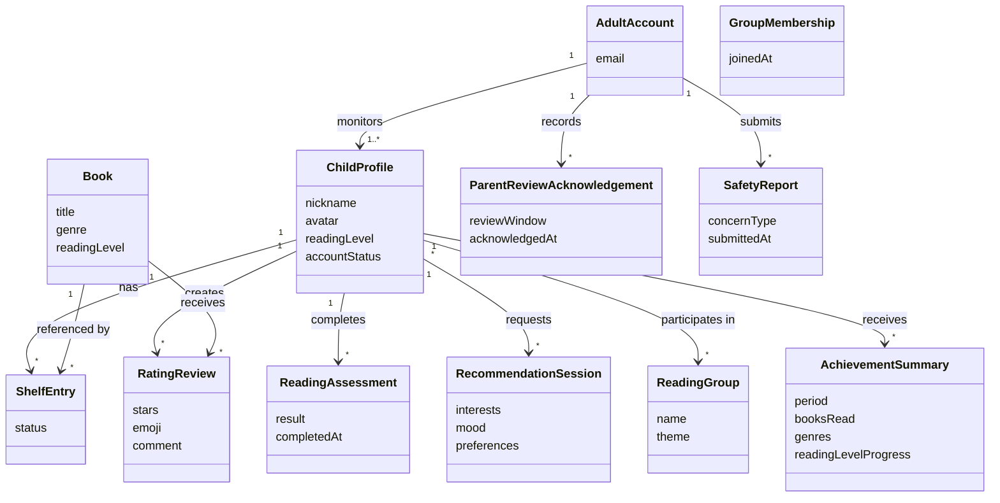

# Software Requirements Specification

**Project:** BookBuddies  
**Team:** _[Team number/name — TBD]_  
**Client:** Yang Yang _[organization/title — TBD]_  
**Version:** 0.1

---

## Revision History

| Date | Version | Description | Author |
|---|---|---|---|
| 2026-09-13 | 0.1 | Initial SRS draft based on client requirements meeting | _[Team — TBD]_ |

---

## 1. Introduction

### 1.1 The purpose of BookBuddies

BookBuddies is a book discovery, recommendation, tracking, and social-sharing application for elementary-aged children, primarily ages 6–11. Its purpose is to help children find books they are genuinely interested in, while giving a parent or other responsible adult enough visibility and control to monitor the child's activity and protect privacy and safety. The application is kid-powered but adult-monitored. It is not an e-reader and does not provide full book-reading functionality inside the application.

### 1.2 The purpose of this document

This document describes the known functional and nonfunctional requirements for the initial BookBuddies release. It is intended to guide the project team, client, developers, and testers by defining the behavior, data, interfaces, constraints, and quality concerns currently supported by the client meeting. Requirements that the client did not settle are identified as open issues rather than being guessed.

### 1.3 Document conventions

Requirement identifiers use the following prefixes:

- `FR-<AREA>-<slug>` — functional requirements that apply across use cases
- `UI-<slug>` — user-interface requirements
- `SI-<slug>` — software/system interface requirements
- `CI-<slug>` — communication-interface requirements
- `DI-<slug>` — data requirements
- `OE-<slug>` — operating-environment requirements
- `CO-<slug>` — design/implementation constraints
- `AS-<slug>` — assumptions
- `DE-<slug>` — dependencies
- `USE-`, `PER-`, `SEC-`, `SAF-`, `AVL-`, `ROB-`, `SCA-`, `INT-`, `MNT-` — quality-attribute requirements

Where practical, requirements are written in EARS form using clear triggers, states, and responses.

### 1.4 References

- [Project glossary](project-glossary.md)
- [Vision and scope](vision-and-scope.md)
- [Use cases](use-cases.md)
- [Business rules](business-rules.md)
- [Open issues](OPEN-ISSUES.md)
- [The Easy Approach to Requirements Syntax (EARS)](https://alistairmavin.com/ears/)
- Client requirements meeting notes/transcript, September 2026

---

## 2. Overall Description

### 2.1 Product perspective

BookBuddies is intended to be a child-facing reading discovery and tracking system with an associated adult-monitoring experience. The initial product centers on five connected activities:

1. determining a child's baseline reading level;
2. helping the child discover books through picture-based prompts, interests, moods, genres, peer activity, manual search, and AI-assisted recommendations;
3. tracking books on a personal shelf;
4. allowing children to rate, comment on, and recommend books within a monitored community; and
5. giving parents/adults visibility into the child's activity and safety controls.

The product is not an e-reader. Teachers and schools are a possible future extension, but they are not part of the current release scope.

### 2.2 User classes and characteristics

#### Child user

- Primary target age: 6–11.
- Uses a nickname and character/avatar rather than public real-world identifying information.
- May have limited typing ability, especially at younger ages, so picture-based discovery is important.
- Can discover books, search, maintain a shelf, rate/comment, participate in groups, and view achievements.
- Has less privilege than the linked adult account.

#### Parent/adult monitor

- Monitors a linked child account.
- Reviews books read and content/comments posted by the child.
- Can intervene when necessary, including removing certain child-posted words/content and reporting concerning material.
- Has ultimate say over the child's continued account use and book choices, but does not need to approve each individual book selection.
- Must review the child's recent application activity within the required review window.

#### System administrator

- Maintains the system operationally.
- The client wants the system designed so an administrator does not have access to child or peer identifying information where technically feasible.
- Exact administrator permissions and necessary operational visibility remain an open issue.

#### Teacher/school user

- Not part of the current release.
- Future direction may allow teachers to provide age-appropriateness feedback without imposing strict book restrictions.

### 2.3 Operating environment

The client meeting did not establish the production platform, supported browsers, mobile requirements, hosting environment, or server operating system.

- `OE-platform-tbd`: The production operating environment shall be defined before implementation is treated as stable.
- See [OPEN-ISSUES.md](OPEN-ISSUES.md) for platform and browser decisions.

### 2.4 Design and implementation constraints

- `CO-child-age-range`: The initial experience shall be designed for elementary-aged children, primarily ages 6–11.
- `CO-no-ereader`: The system shall not provide full in-application book-reading/e-reader functionality in the initial scope.
- `CO-parent-current-scope`: The current release shall support parent/adult monitoring; teacher-specific control is outside the current release.
- `CO-child-anonymous-profile`: The child-facing profile shall use a nickname and non-photographic character/avatar rather than exposing real-world identity to other child users.
- `CO-privacy-first`: The design shall prioritize child and peer privacy and confidentiality.
- `CO-admin-pii-minimization`: The design shall minimize, and where feasible prevent, administrator access to personally identifying child information.
- `CO-email-preference`: Where an account contact method is required, email is the client's preferred direction over phone-number-based collection; the exact account identity model remains unresolved.

### 2.5 Assumptions and dependencies

- `AS-linked-adult`: A child account is expected to have a linked parent/adult monitor, but the exact account-creation sequence is not yet decided.
- `AS-seed-library-size`: The initial catalog is expected to contain approximately 30–50 elementary-level books across multiple genres.
- `DE-book-source`: The initial catalog depends on a source of book metadata, such as Google Books or another suitable service; the final source is TBD.
- `DE-reading-assessment`: The baseline reading-level feature depends on an online reading-level assessment or equivalent method; the final assessment source is TBD.
- `DE-ai-service`: AI-assisted recommendation and analysis depend on an AI service or model that has not yet been selected.
- `AS-parent-privileges-evolving`: Parent privilege details may change after the client's follow-up notes and must be reconciled before finalizing authorization behavior.

---

## 3. Project Glossary

See [project-glossary.md](project-glossary.md).

---

## 4. Vision and Scope

See [vision-and-scope.md](vision-and-scope.md).

For this SRS draft, the confirmed scope boundary is:

**In scope:** book discovery and recommendation, baseline reading-level assessment, personal shelf/tracking, ratings/comments, peer/community features, user-created groups, achievement summaries, optional reading-level stretching, and parent/adult monitoring.

**Out of current scope:** reading complete books inside BookBuddies; teacher/school administration features; teacher-imposed book restrictions.

---

## 5. Functional Requirements

### 5.1 Use cases

See [use-cases.md](use-cases.md). Expected major use cases include account setup, reading assessment, finding a new book, manual book search, managing the shelf, rating/commenting on a book, viewing peer activity, joining/participating in a group, viewing achievements, opting into a higher reading level, parent review, parent moderation, and reporting concerning content.

### 5.2 Non-use-case functional requirements

#### Accounts and authorization

- `FR-AUTH-linked-adult`: While a child account is active, the system shall associate it with a parent/adult monitoring relationship.
- `FR-AUTH-parent-review-access`: The system shall allow the linked adult to review the child's recorded reading activity and child-posted comments/content.
- `FR-AUTH-parent-moderate-content`: When the linked adult chooses to remove child-posted words or content, the system shall remove or hide that content from the application's user-facing community surfaces.
- `FR-AUTH-parent-account-control`: The system shall allow the linked adult to suspend or close the child's account.
- `FR-AUTH-book-choice-no-per-item-approval`: The system shall not require parent approval for every individual book selection as part of the normal child workflow.

#### Parent review window

- `FR-REVIEW-acknowledge-24h`: Within each 24-hour review window, the system shall provide the linked adult a way to confirm that they reviewed the child's recent activity and have no objection.
- `FR-REVIEW-suspend-missed`: If the required adult review acknowledgement is not completed within the applicable 24-hour review window, then the system shall temporarily suspend the child account.
- `FR-REVIEW-reactivation-tbd`: The method for restoring a temporarily suspended account is not yet defined and shall remain an open issue.

#### Reading level and onboarding

- `FR-READING-baseline-assessment`: When a child account is initially created, the system shall provide a baseline reading-level assessment rather than requiring the child or parent to self-report the reading level.
- `FR-READING-store-baseline`: When the baseline assessment is completed, the system shall store the resulting reading-level value for use in recommendations and progress tracking.
- `FR-READING-progress`: The system shall support tracking changes in the child's reading level over time.

#### Book catalog

- `FR-CATALOG-seed-library`: The initial system shall support a seed library of approximately 30–50 elementary-reading-level books.
- `FR-CATALOG-multiple-genres`: The initial seed library shall include books from multiple genres, including examples such as comics and graphic novels.

#### Recommendation and discovery

- `FR-REC-picture-quiz`: When a child requests a new personalized book recommendation, the system shall present the picture-based recommendation questions again; the quiz shall not be limited to first-time onboarding.
- `FR-REC-use-preferences`: The recommendation process shall consider the child's expressed interests, moods, reading ability, and prior preferences.
- `FR-REC-use-history`: Where prior ratings or comments exist, the system shall be able to use them to refine future recommendations.
- `FR-REC-ai-assisted`: The system shall support AI-assisted analysis for recommendation refinement, including analysis of child comments/ratings.
- `FR-REC-manual-search`: The system shall allow a child to manually search for a book using text/word-based search.
- `FR-REC-no-reading-content`: Book discovery results shall direct the child to book information/tracking actions rather than functioning as an in-app e-reader.

#### Shelf and tracking

- `FR-SHELF-save-book`: The system shall allow a child to add a book to a personal shelf.
- `FR-SHELF-track-status`: The shelf shall support tracking books the child wants to read, has read, or wants to recommend.
- `FR-SHELF-reread`: The shelf shall support a child recording or returning to a previously read book for rereading/tracking purposes.

#### Ratings, comments, and community rating

- `FR-RATE-child-rating`: After reading a book, the system shall allow a child to provide an individual rating using stars, an emoji, and a comment.
- `FR-RATE-independent`: One child's rating shall not overwrite or determine another child's individual rating.
- `FR-RATE-community-aggregate`: When multiple children have rated the same book, the system shall support displaying an aggregate community view of those ratings.
- `FR-RATE-comment-recommendation-input`: The system shall make child comments available as input to the recommendation process where AI-assisted analysis is enabled.

#### Peer activity

- `FR-PEER-feed`: The system shall provide a peer-facing activity surface that allows children to see what friends or classmates are reading, subject to privacy and moderation controls.
- `FR-PEER-anonymous-identity`: Peer-facing activity shall identify children by nickname/avatar rather than real-world identifying information.

#### Groups

- `FR-GROUP-user-initiated`: The system shall support user-initiated reading communities rather than requiring groups to be imposed by teachers or adults.
- `FR-GROUP-membership-range`: A group shall support approximately 2–20 child members.
- `FR-GROUP-purpose`: Groups may represent a class, a group of friends, or a shared reading interest such as comics or action books.
- `FR-GROUP-teacher-restriction-out-of-scope`: The current release shall not give teachers authority to impose strict book restrictions on child group members.

#### Achievements and Stretch My Reader

- `FR-ACH-achievement-summary`: The system shall support recurring achievement summaries on a weekly and/or monthly basis showing reading progress such as books read, genres, and reading-level progress.
- `FR-ACH-engagement`: The achievement experience shall be designed as an interactive progress/achievement feature rather than as a purely administrative report.
- `FR-STRETCH-offer-next-level`: When a child reaches a reading milestone or views an achievement summary, the system shall be able to offer an optional higher-reading-level recommendation path.
- `FR-STRETCH-opt-in`: The system shall not automatically force the child into higher-level recommendations; the child shall be able to choose whether to explore the next level.

#### Safety reporting

- `FR-SAFETY-parent-report`: When a linked adult identifies content related to abuse, self-harm, or harm to others, the system shall provide a way to report that content or concern.
- `FR-SAFETY-report-workflow-tbd`: The recipient, escalation path, and post-report handling of such reports are not yet defined.

#### Privacy and deletion

- `FR-PRIV-parent-removal-request`: When a parent requests removal of a child's stored record, the system shall support removal of that record.
- `FR-PRIV-peer-protection`: The system shall protect the identities of both the child using the system and other child peers/buddies.

---

## 6. Business Rules

See [business-rules.md](business-rules.md).

The current meeting established several rules that should be given formal `BR-*` identifiers in that document before this SRS is finalized, including:

- children are the primary users, but an adult monitors activity;
- parent/adult review is required within a 24-hour window;
- missed review temporarily suspends the child account;
- parents have ultimate account/book authority but do not approve every book choice;
- child public/community identity should remain anonymous;
- teachers are not decision-makers in the current release;
- BookBuddies is a recommendation/tracking application, not an e-reader.

---

## 7. Data Requirements

### 7.1 Business domain model

### 7.2 Data dictionary

| Entity | Field | Type / Allowed Values | Requirement / Validation |
|---|---|---|---|
| AdultAccount | email | Email address | Preferred account contact/identity direction from client; exact sign-in model TBD |
| ChildProfile | nickname | Text | Used in place of public real-world identity |
| ChildProfile | avatar | Character/avatar selection | Should not require a real child photograph |
| ChildProfile | readingLevel | Assessment result | Initially populated from baseline assessment |
| ChildProfile | accountStatus | active / temporarily suspended / closed | Supports review-window and parent-control behavior |
| Book | title | Text | Obtained from seed catalog / external book source |
| Book | genre | One or more categories | Seed catalog spans multiple genres |
| Book | readingLevel | Elementary reading-level metadata | Exact scale/source TBD |
| ShelfEntry | status | want-to-read / read / recommend | Tracks the child's relationship to a book |
| RatingReview | stars | Star rating | Exact star scale not explicitly confirmed in meeting |
| RatingReview | emoji | Emoji selection | Child-friendly expression of opinion |
| RatingReview | comment | Text | Parent-reviewable and usable for recommendation analysis |
| ReadingAssessment | result | Reading-level value | Exact test and scale TBD |
| RecommendationSession | interests | Selection(s) | Used as recommendation input |
| RecommendationSession | mood | Selection(s) | Used as recommendation input |
| RecommendationSession | preferences | Picture/word responses | Collected each time a child seeks a new personalized book |
| ReadingGroup | name/theme | Text/category | User-initiated community |
| GroupMembership | membership | Child-to-group relation | Group size target approximately 2–20 children |
| AchievementSummary | period | weekly and/or monthly | Exact cadence may support one or both |
| ParentReviewAcknowledgement | reviewWindow | 24-hour review period | Used to determine whether temporary suspension is required |
| SafetyReport | concernType | abuse / self-harm / harm-to-others / other TBD | Follow-up workflow TBD |

### 7.3 Reports

#### Child achievement summary

- **Audience:** child; optionally visible to parent.
- **Cadence:** weekly and/or monthly.
- **Contents:** books read, genres, reading-level progress, milestone/achievement information.
- **Purpose:** engagement, progress visibility, and optional entry point to “Stretch My Reader.”
- **Format:** in-application achievement page; final visual format TBD.

#### Parent activity review

- **Audience:** linked parent/adult.
- **Cadence:** supports review within each 24-hour window.
- **Contents:** recent books/activity and child-posted comments/content sufficient for the adult to confirm review.
- **Format:** in-application review surface; final design TBD.

### 7.4 Data acquisition, integrity, retention, and disposal

- `DI-book-acquisition`: Initial book metadata shall be acquired from a seed library and may come from Google Books or another external source; the final source is TBD.
- `DI-reading-level-acquisition`: Initial reading level shall come from a baseline reading assessment rather than child/parent self-report.
- `DI-review-content`: Child comments and reading activity shall be retained long enough to support parent review and recommendation refinement; the exact retention period is TBD.
- `DI-parent-delete`: The system shall support removal of a child's stored record when requested by the parent/adult with authority over the child account.
- `DI-pii-minimization`: The system shall minimize collection and exposure of child identifying data and shall not expose child or peer real-world identity through community-facing profiles.
- `DI-retention-tbd`: Specific retention periods, deletion propagation rules, backup deletion rules, and legal retention obligations remain open issues.

---

## 8. External Interface Requirements

### 8.1 User interfaces

- `UI-onboarding`: The system shall provide an account/onboarding flow that establishes the child/adult relationship and initiates the child's baseline reading assessment.
- `UI-home-discovery`: The child home/discovery experience shall provide a clear “What should I read?” path with genre/mood or equivalent preference options.
- `UI-picture-recommendation`: The system shall provide a child-friendly picture-based recommendation questionnaire for personalized book discovery.
- `UI-manual-search`: The system shall provide text-based manual book search, especially for children able to search by words/title.
- `UI-shelf`: The system shall provide a personal shelf view for book tracking.
- `UI-peer-feed`: The system shall provide a peer/community activity feed or equivalent view showing what friends/classmates are reading without exposing real identities.
- `UI-rating`: The system shall provide controls for stars, emoji, and a comment when a child rates a book.
- `UI-groups`: The system shall provide interfaces to view/join user-initiated reading groups.
- `UI-achievements`: The system shall provide weekly/monthly achievement/progress views.
- `UI-stretch-reader`: The achievement/progress experience shall be able to offer an optional “next level”/Stretch My Reader action.
- `UI-parent-review`: The linked adult shall have a review interface for recent child activity and the 24-hour acknowledgement.
- `UI-parent-controls`: The linked adult shall have access to supported moderation, reporting, suspension, and closure controls.

No formal accessibility standard or usability threshold was agreed in the client meeting. Those are open issues.

### 8.2 Hardware interfaces

None were identified in the client meeting.

### 8.3 Software interfaces

- `SI-book-catalog-source`: The system is expected to integrate with a book-information source such as Google Books or another suitable service. The selected service, data fields, authentication, quotas, and outage behavior are TBD.
- `SI-reading-assessment`: The system is expected to use or integrate with an online reading-level assessment or equivalent capability. The selected assessment and integration method are TBD.
- `SI-ai-recommendation`: The system is expected to use an AI capability for analysis/recommendation refinement. The provider/model, privacy controls, data sent to the service, and fallback behavior are TBD.

### 8.4 API document

API documentation shall be linked here once implementation begins and the API is generated from the codebase.

### 8.5 Communications interfaces

- `CI-email-preferred`: Email is the preferred communication/account-contact direction discussed by the client compared with phone-number-based collection.
- `CI-notification-mechanism-tbd`: The meeting did not define whether parent review reminders, suspension notices, or reports are delivered by email, in-app notification, or another channel.

---

## 9. Quality Attributes

The client provided strong qualitative direction around privacy, safety, and child appropriateness, but did not establish quantitative thresholds for performance, availability, response time, accessibility conformance, scale, or recovery. Those values must not be invented.

### 9.1 Usability

- `USE-child-appropriate`: The primary child experience shall support children ages 6–11 and shall include picture-based interaction for book discovery rather than requiring all discovery to be text-based.
- `USE-manual-search-older-readers`: The system shall also provide word-based search for children who are comfortable using it.
- A formal usability success metric is **TBD**.

### 9.2 Performance

No measurable performance threshold was specified by the client. `PER-*` thresholds are **TBD** and should be set only after the team/client makes an explicit, testable decision.

### 9.3 Security and privacy

- `SEC-community-anonymity`: Community-facing child profiles shall not expose real-world child identity.
- `SEC-peer-identity-protection`: The system shall protect the identifying information of peer/buddy users as well as the current child user.
- `SEC-parent-authorized-controls`: Parent/adult moderation and account-control actions shall be limited to an authorized linked adult relationship.
- `SEC-admin-pii-minimization`: The system shall minimize administrator access to personally identifying child information; the exact technical enforcement model is TBD.
- `SEC-parent-removal`: The system shall support parent-requested removal of a child's stored record.

### 9.4 Safety

- `SAF-adult-monitoring`: The child account shall operate under linked adult monitoring in the current scope.
- `SAF-review-window`: Failure to complete the required adult review within the applicable 24-hour window shall cause temporary child-account suspension.
- `SAF-risk-reporting`: The linked adult shall have a mechanism to report content or concerns involving abuse, self-harm, or harm to others.
- `SAF-no-forced-level-up`: The system shall not automatically force a child into higher reading-level recommendations when using Stretch My Reader.

### 9.5 Availability

No availability percentage or service-hours commitment was specified. `AVL-*` threshold is **TBD**.

### 9.6 Robustness

No recovery-point, autosave, disconnect, or error-handling threshold was specified. `ROB-*` thresholds are **TBD**.

### 9.7 Scalability, interoperability, maintainability

- **Scalability:** No expected user count, school count, or transaction volume was specified. `SCA-*` is **TBD**.
- **Interoperability:** External book, reading-assessment, and AI integrations are expected, but providers and interface contracts are **TBD**.
- **Maintainability:** No post-graduation maintainer, required language/framework, or maintenance environment was specified. `MNT-*` is **TBD** and should be decided deliberately by the team/client rather than inferred.

---

## 10. Internationalization and Localization

The client meeting did not specify supported languages, locales, time zones, date formats, or internationalization requirements. The initial locale should not be assumed in the specification without a team/client decision. See [OPEN-ISSUES.md](OPEN-ISSUES.md).

---

## 11. Other Requirements

### Legal and child-data compliance

The client discussed privacy, confidentiality, adult review, and possible compliance concerns because the application is for children. However, no specific legal standard or compliance interpretation was definitively established in the meeting.

- The system requirements shall not claim legal compliance solely because the 24-hour parent-review feature exists.
- Applicable child-privacy/legal requirements must be researched and confirmed separately before production deployment.
- Any compliance standard adopted by the team/client should be added here as an explicit external constraint and testable requirement.

---

## Current Open-Issue Summary

See [OPEN-ISSUES.md](OPEN-ISSUES.md) for the full list. The highest-priority unresolved items are:

1. parent-first versus child-first account creation and exact email/sign-in model;
2. final parent privileges after the client's promised follow-up notes;
3. exact book catalog/API source;
4. exact reading-level assessment source and scale;
5. AI provider, data-sharing boundaries, and fallback behavior;
6. deployment platform, browser/mobile support, and hosting;
7. retention/deletion rules and administrator access to PII;
8. escalation workflow after an abuse/self-harm/harm report;
9. quantitative usability, performance, availability, robustness, and maintainability targets;
10. exact recommendation-ranking behavior combining personal preferences and community ratings.
