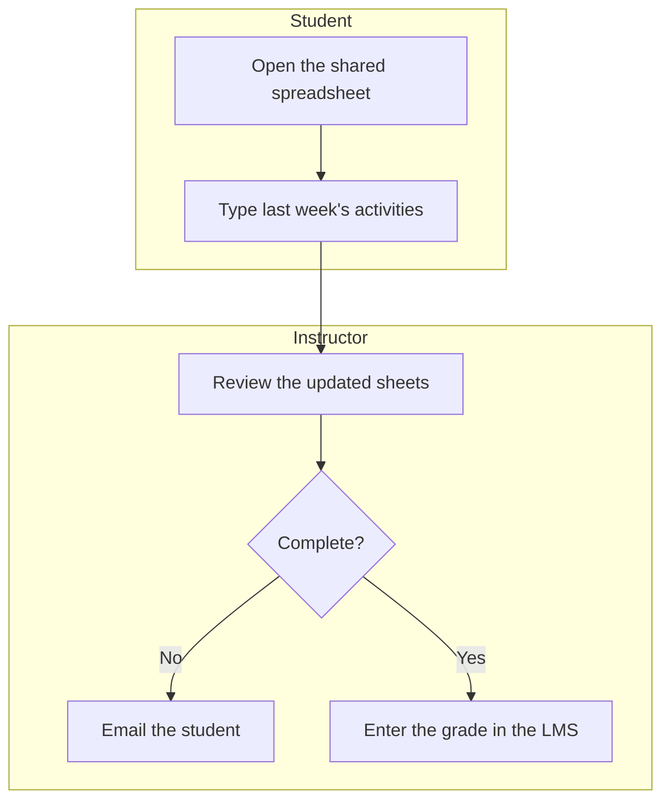
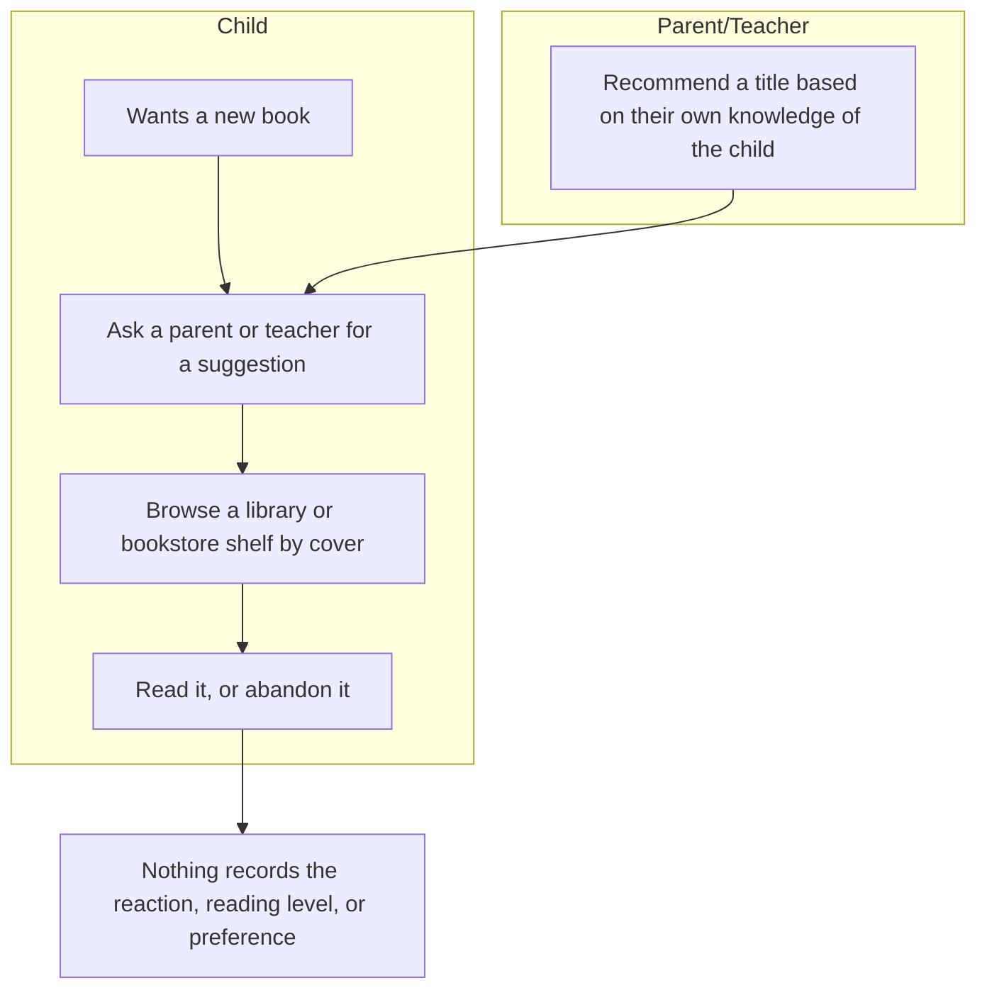
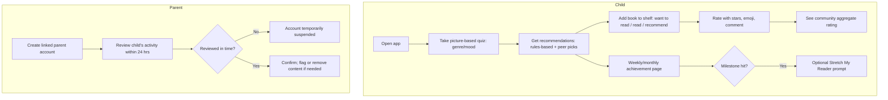
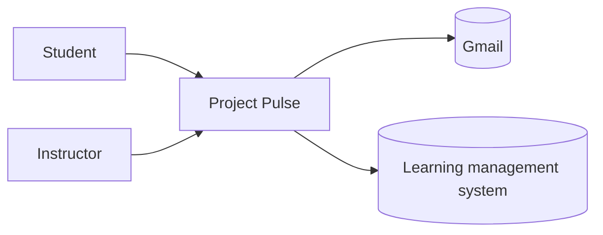
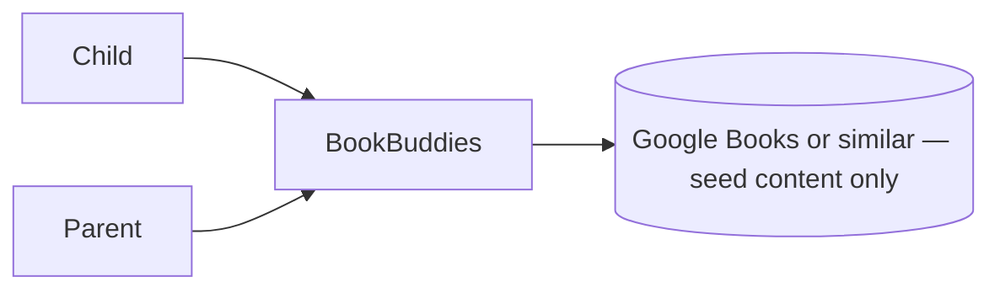

# Vision and Scope
**Project:** BookBuddies
**Team:** 5
**Client:** Yang Yang
**Version:** 0.2
 
---
 
_**How to use this template.** Every section below opens with an instruction in italic square brackets: what the section is for, how to produce it, a worked example, and a checklist. Fill in the section underneath the instruction. **Leave the instructions in the file until the document is stable.** They are context for you, for the teammate who writes a later section, and for your AI teammate, which reads this file every time it works on your project._
 
_**This document has two readers.** Your client has to recognize their own business in it, so avoid jargon they would not use. Your AI teammate has to build from it, so avoid a claim it cannot check. When the two pull against each other, write for the client and put the precision in the use cases._
 
_**Work it with your agent, not instead of it.** Give the agent this template, your one-page project brief, and your meeting notes, then put it in a role: "You are an experienced business analyst. Using the instructions in this template, draft section X, and list every question you cannot answer from what I gave you." The questions it cannot answer are the point. They go in [OPEN-ISSUES.md](OPEN-ISSUES.md) and they become the agenda for your next client meeting. What the agent cannot do is decide which of its questions deserve your client's limited time, or tell enthusiasm apart from commitment. That judgment is yours._
 
## Identifiers in this document
 
_Identifiers here are **name-based slugs**, never numbers._
 
| Space | Shape | Example |
|---|---|---|
| Business objective | `BO-<slug>` | `BO-grading-time` |
| Success metric | `SM-<slug>` | `SM-submission-rate` |
| Risk | `RI-<slug>` | `RI-cloud-cost` |
| Assumption or dependency | `AS-<slug>` | `AS-client-maintains-stack` |
| Feature | `FEAT-<slug>` | `FEAT-performance-tracking` |
 
_Coin each slug from the concept itself: short, kebab-case, unique within its space. **Never renumber, rename, or repoint an identifier.** A new item gets a new slug; a retired item keeps its slug and is marked withdrawn. Cite items by identifier, never by position in a list ("the third objective")._
 
_Why this matters more with an agent than it used to: ask an agent to insert a new objective into a list numbered `BO-1` through `BO-6` and it has two options. Renumber everything, silently breaking every citation in your use cases and your specification, or append out of order. No test you can write detects either one. A slug has neither failure mode, and it tells a reader what the item is at the place it is cited._
 
## Revision History
 
| Date | Version | Description | Author |
|---|---|---|---|
| _[YYYY-MM-DD]_ | 0.1 | Initial draft from the client brief and first client meeting | _[Name]_ |
 
---
 
## 1. Introduction
 
_[This document defines the goals, purpose, and boundaries of the project. It gives every stakeholder a shared understanding of what the software is for and the context it operates in: the business problem being solved, how the software fits into the client's world, and where the line falls between what is in scope and what is not.]_
 
### 1.1 Background
 
_[Summarize the rationale and context for the new product, or for the changes to an existing one. Describe the situation that led to the decision to build it.]_
 
_**Step 1: Describe the business.** Introduce the organization. Cover what it does (industry, products, services), its size (employees, locations), and the goals that relate to the problem you are solving._
 
_Example: "The client, XYZ Logistics, is a mid-sized shipping company that specializes in last-mile delivery services for e-commerce businesses. The company operates in five major cities, employs 200 delivery staff, and handles over 10,000 deliveries per day. The goal is to optimize delivery efficiency and customer satisfaction."_
 
_**Checklist:** Would a reader who has never heard of this organization understand what it does and why this project exists?]_
 
The client, Yang Yang, brought the team an existing concept for **BookBuddies**, a book discovery and tracking app for elementary-age kids (roughly ages 6–11). The concept was presented to the team via slides and a working Shiny app demo before requirements work began. The motivating problem is not a shortage of age-appropriate books — it is that nothing today matches a specific child to books they will actually enjoy, tracks what they have read, or gets better at recommending as it learns their taste. BookBuddies is meant to be kid-powered (the child drives what they read next) but adult-monitored (a linked parent account retains oversight and safety controls).
 

 
### 1.2 Current Process Flows (As-Is Process Flows)
 
_[Most projects require everyone involved to have a firm grasp of the business process being created, replicated, or improved. Without that understanding there is little chance users adopt the new solution. Process flows are the most effective model for building it.]_
 
_**Step 1: Diagram the current process.** Draw the process people execute **today**, before your software exists, as a mermaid flowchart with **one subgraph per actor** (roles, departments, existing systems). Show the sequence of activities, the decision points, and the handoffs between actors._
 
_Diagrams in this project are authored as mermaid inside the Markdown file, never exported from a drawing tool as an image. A picture of a diagram is invisible to your AI teammate and unreadable in a diff; a mermaid block is text it can read and revise. A skeleton to start from:_
 

 
_**Step 2: Write the prose.** Not every reader reads diagrams. Explain the flow in a paragraph underneath it._
 
_**Step 3: List the current tools.** Enumerate what the process runs on today (spreadsheets, paper schedules, email, a legacy system) and give the limitation of each._
 
_Example: "XYZ Logistics relies heavily on Excel spreadsheets for order management. Printed delivery schedules are distributed to drivers daily. These tools lack automation, making the process prone to human error and delays."_
 
_**Step 4: Name the pain points.** Highlight the inefficient, slow, or error-prone steps, using one or two specific examples rather than a general complaint._
 
_Inefficiency example: "Manual entry of order details into Excel causes delays and transcription errors. During peak season, order entries pile up, delaying processing and delivery."_
 
_Time example: "Printing and distributing delivery schedules to drivers takes 2 hours daily, cutting into time available for deliveries."_
 
_**Step 5: Write for an outsider.** Assume your reader knows nothing about this domain. Define every domain term on first use and add it to the [project glossary](project-glossary.md)._
 
_**Checklist:** Is the business context clear to someone unfamiliar with it? Does the flow give step-by-step detail? Are all actors and tools described? Are the inefficiencies illustrated with specific examples? Is there a mermaid diagram with one subgraph per actor?]_
 
BookBuddies is a green-field product — there is no existing BookBuddies system to replace. The "as-is" process is the informal, tool-less way a child finds a book to read today:
 

 
A parent or teacher suggests titles from their own limited knowledge of the child's interests, or the child browses a shelf and picks by cover. No tool tracks what the child has read, liked, or is ready for next, so each recommendation starts from scratch rather than building on the last one.
 
**Current tools:** word of mouth from parents and teachers; browsing a physical library or bookstore shelf; in some schools, a reading-level test administered by the school itself (see below). None of these are BookBuddies-adjacent software — there is nothing to migrate from.
 
**Pain points:**
- Recommendations are capped by what the parent or teacher happens to know about the child, not what the child would actually enjoy.
- A formal reading-level baseline often does not exist until school testing catches up — the client noted some schools do not test until 2nd or 3rd grade — so books in the meantime may be pitched at the wrong level.
- Nothing is tracked between one book and the next, so there is no way to see whether a child's taste or level is changing over time.

 
### 1.3 References
 
_[List every document referenced elsewhere in this one: the client's project brief, existing forms and reports, regulations, standards, competing products. Identify each by title, date, and where it can be obtained. The spreadsheet or screenshot your client showed you belongs here.]_
 
- Client interview notes, 2026-09-10 — `docs/requirements/client-interview-2026-09-10.md`
- Team napkin assessment, undated — `docs/napkin-round-0.md`
- Yang's follow-up design notes ("BookBuddies Profiles"), 2026-09-12 — seed catalog tagging domains, recommender staging, adult- and kid-facing profile scope, and gamification badge concepts. Not yet added to the repo — add alongside this revision.
- Original concept slide deck — Yang Yang, not yet added to the repo (see `OI-3`)
- Shiny app demo link — Yang Yang, not yet added to the repo (see `OI-3`)
---
 
## 2. Business Requirements
 
_[Projects are launched in the belief that creating or changing a product will provide worthwhile benefits for someone. Business requirements describe the primary benefits the new system will provide to its sponsors, buyers, and users. Input comes from the people who know **why** the project is being undertaken: your client, their management, a subject matter expert, a product visionary. Business requirements determine which user requirements get implemented and in what order, so take this section seriously.]_
 
### 2.1 Business Opportunity or Problem Statement
 
_[State the problem being solved or the opportunity being exploited, in the client's own terms. One or two paragraphs. This is the answer to "why is anyone paying for this?"]_
 
Elementary-age kids struggle to find books they're excited to read — not because age-appropriate books don't exist, but because nothing matches a specific child's taste, mood, and reading level the way a great librarian or a well-read parent might, and nothing improves as it learns more about that child. Parents and teachers can only point kids toward grade-appropriate titles, which is a blunt instrument. Yang Yang wants BookBuddies to close that gap: a kid-facing app that recommends books a child will actually enjoy, tracks what they've read on a personal shelf, and adds a light social layer (peer picks, small reading groups) — all while giving parents the oversight a product for this age group requires.
 
### 2.2 Business Objectives
 
_[Summarize the business benefits the product will provide, **quantitatively and measurably**. Platitudes ("become recognized as a world-class provider") and vague improvements ("provide a more rewarding customer experience") are neither helpful nor verifiable.]_
 
_Examples:_
 
- _`BO-grading-time`: Reduce the instructor's time to grade peer evaluations by 50%._
- _`BO-submission-rate`: Increase the weekly activity report and peer evaluation submission rate by 20%._
- _`BO-student-effort`: Reduce the time a student spends completing a weekly activity report and peer evaluation by 25%._
_**How to elicit these.** Clients rarely volunteer numbers. Ask: What business problem are you trying to solve? What is the motivation for solving it now? What would a highly successful solution do for you? What is a successful solution worth? If the answer contains no number, ask what the number is today._
 
_**Checklist:** A year from now, could someone tell whether each objective was met? Does each one contain a quantity?]_
 
_The client has not yet given the team target numbers for these. The objectives below are the team's draft candidates, built from what the client described wanting, and are marked DRAFT until confirmed. Bring these to the client as-is and ask for the number — see `OI-4`._
 
- `BO-book-engagement` (DRAFT): Increase the number of books a child finishes reading per month, relative to before using the app, by a target percentage TBD with the client.
- `BO-recommendation-relevance` (DRAFT): Increase the share of quiz/AI-suggested books a child rates positively (e.g., 4+ stars or a "loved it" reaction) to a target percentage TBD with the client.
- `BO-parent-oversight-efficiency` (DRAFT): Reduce the time a parent spends reviewing a child's activity to complete the 24-hour compliance check, to a target TBD with the client.
### 2.3 Success Metrics
 
_[Business objectives say what should improve. Success metrics tell you **whether you are on track to get there**, and they can be measured far sooner. That gap is the reason this section exists. A business objective often cannot be measured until well after the project ends, and sometimes depends on projects beyond yours, but you still need to know during the semester whether you are heading the right way.]_
 
_Specify the indicators stakeholders will use to define and measure success on this project. Identify the factors with the greatest impact on achieving it, including factors outside the organization's control._
 
_A success metric is sometimes the same statement as a business objective, when the objective happens to be measurable early. "Reduce time spent ordering chemicals to 10 minutes on 80 percent of orders" serves as both, because average order time can be measured during testing or shortly after release. Where an objective is measured a year out, write a metric that tracks the same thing on a shorter timeline: against an adoption objective measured annually, "track 60 percent of commercial chemical containers and 50 percent of proprietary chemicals within 4 weeks"._
 
_For each metric give the indicator, where the number comes from, what it is today (the baseline), and what counts as success by when. A metric with no baseline is not measurable, and "we do not track that today" is a finding worth recording rather than a gap to paper over._
 
_Examples:_
 
- _`SM-cafeteria-adoption`: 75% of employees who used the cafeteria at least 3 times per week during Q3 2013 use the Cafeteria Ordering System at least once a week, within 6 months following initial release._
- _`SM-satisfaction`: The average rating on the quarterly cafeteria satisfaction survey increases by 0.5 on a scale of 1 to 6 from the Q3 2013 rating within 3 months following initial release, and by 1.0 within 12 months._
_**How to elicit these.** Ask "how will you know this worked?", then ask what that number is today. If your client cannot say, ask who would know and whether the number is recorded anywhere. Clients often propose a metric the software cannot influence (revenue, headcount); trace it back to something your system actually changes._
 
_**Choose your success metrics wisely. Make sure they measure what is important to the business, not just what is easy to measure.** "Reduce product development costs by 20 percent" is easy to measure, and also easy to achieve by laying off employees or investing less in innovation, neither of which is the intended outcome. Prefer a metric that gets worse if you build the wrong thing._
 
_**Checklist:** Does each metric name its source, its baseline, and its deadline? Can this software actually move it? Can it be measured during testing or shortly after release, rather than a year later? Does every business objective have at least one metric behind it, and does every metric trace back to an objective?]_
 
_Also draft, pending client numbers — see `OI-4`._
 
- `SM-quiz-usage` (traces to `BO-recommendation-relevance`): Share of active child accounts that request a new recommendation quiz at least once a week. Baseline: N/A (new product). Target: TBD.
- `SM-shelf-activity` (traces to `BO-book-engagement`): Share of active child accounts that add at least one book to their shelf within their first two weeks. Baseline: N/A. Target: TBD.
- `SM-review-compliance` (traces to `BO-parent-oversight-efficiency`): Share of parent accounts that complete the 24-hour review check without the account being suspended. Baseline: N/A. Target: TBD.
### 2.4 Vision Statement
 
_[One statement summarizing, at the highest level, the position this product intends to fill. Fill in the table.]_
 
| | |
|---|---|
| **For** | elementary-age kids (roughly 6–11) |
| **Who** | want to find books they'll actually enjoy, not just books that are age-appropriate |
| **The** _BookBuddies_ | is a kid-facing app with linked, parent-managed accounts |
| **That** | recommends books through a picture-based quiz and peer activity, tracks what a child reads on a personal shelf, and lets kids form small reading groups with friends or classmates |
| **Unlike** | relying on a parent's or teacher's personal knowledge to suggest books, with nothing tracked or improved over time |
| **Our product** | centers recommendations on what the individual kid enjoys, not just their grade level, while giving parents the safety and review controls this age group requires |
 
_Worked example:_
 
| | |
|---|---|
| **For** | _students in the TCU senior design course_ |
| **Who** | _need an easier way to submit and update weekly activity reports and peer evaluations_ |
| **The** _Project Pulse_ | _is a web application_ |
| **That** | _lets students submit reports and evaluations in one place, and lets instructors view and grade them without downloading anything_ |
| **Unlike** | _the current process of spreadsheets and manual uploads to the learning management system_ |
| **Our product** | _keeps the whole cycle in one system, so nothing is transcribed by hand_ |
 
_**Use this in the meeting.** Read the filled-in table back to your client out loud and watch what they correct. It is the fastest way to discover you misunderstood the project, and it costs ninety seconds. Corrections go straight into [OPEN-ISSUES.md](OPEN-ISSUES.md)._
 
### 2.5 Proposed Process Flows (To-Be Process Flows)
 
_[Draw the improved process, with your software in it, as a second mermaid flowchart in the same shape as the as-is flow. Show how the software interacts with each actor, which steps it automates, and which pain point from section 1.2 each change addresses. Label the steps that are new or significantly changed, and say plainly which manual steps **remain** and why. There may be several major flows.]_
 
_The point of drawing both is the comparison. If the two diagrams look alike, either you have not understood the current process or the software is not worth building._
 

 
The quiz-driven recommendation (new) replaces the ad hoc adult suggestion from the as-is flow, directly addressing the "recommendations capped by what the adult knows" pain point. The shelf and ratings (new) replace the "nothing is tracked" pain point. The achievement page (new) gives visibility into reading-level progress that today isn't visible until school testing catches up.
 
**What stays manual:** the parent retains final say on a child's books — the client was explicit that this does not mean approving every individual choice, but the review-and-flag step is a deliberate, permanent part of the design, not a gap the software is expected to close.
 
### 2.6 Risks
 
_[Summarize the major business risks of building this product, and of not building it. Categories include competition, timing, user acceptance, implementation, and negative impact on the business. Business risks are not project risks: "a teammate might drop the course" is a project risk and does not belong here. Give probability and impact for each, and a mitigation where you have one.]_
 
_Examples:_
 
- _`RI-union-contract`: The Cafeteria Employees Union might require its contract be renegotiated to reflect the new employee roles and operating hours. (Probability 0.6, Impact 3)_
- _`RI-low-adoption`: Too few employees might use the system, reducing the return on the development investment and on the changes to cafeteria operating procedures. (Probability 0.3, Impact 9)_
- _`RI-no-delivery-partners`: Local restaurants might not agree to offer delivery, reducing employee satisfaction with the system and their use of it. (Probability 0.3, Impact 3)_
_**State risks as mechanisms, not categories.** "Security risk" names a category and tells nobody anything. "The peer evaluation database holds student grades, is reachable from the public internet, and has no rate limiting" names a mechanism someone can act on._
 
- `RI-pii-boundary-leak`: A child's identifiable information could reach another user, a group member outside the intended circle, or the system admin through a support or debug tool, if the anonymous-profile boundary is not enforced at the data layer rather than just in the UI. Given the product handles children's accounts, this is a COPPA-adjacent exposure, not just a bug. (Probability 0.3, Impact 9). Mitigation: segregate PII from admin-visible tables/APIs from the first schema design, not retrofitted later. *Yang's 2026-09-12 design notes sharpen this into two boundaries the system must keep separate: a **data boundary** (the recommender can learn from any registered user's anonymous behavior platform-wide) and a **social boundary** (a child only sees another child's name or picks once both families' adults have approved the connection). Conflating the two — e.g., letting a group-visibility check also gate what the recommender is allowed to learn from — is the likely failure mode.*
- `RI-review-window-unenforced`: If the 24-hour parental review window is built as a UI reminder instead of a server-enforced suspension workflow, a parent who never opens the app leaves a child's account fully active indefinitely, defeating the control it exists to provide. (Probability 0.3, Impact 7).
- `RI-content-tagging-quality`: If the 30–50 seed books are not tagged consistently for genre, mood, and reading level, the recommendation quiz will feel random to a child regardless of how the matching logic is written. (Probability 0.4, Impact 6).
- `RI-scope-creep-ai`: The "AI-powered" language from the original concept deck could pull the team into building comment/rating sentiment analysis before the core recommendation loop and safety layer are solid, risking a December milestone that doesn't ship a working loop at all. (Probability 0.4, Impact 7). Mitigation: lock the MVP feature list (section 4.3) with the client and defer AI-driven analysis explicitly.
- `RI-empty-social-layer`: Because part of the value is peer picks and groups, a small initial pilot with too few kids could make the social features feel empty, which in turn reduces the engagement they're meant to drive. (Probability 0.3, Impact 5).
### 2.7 Business Assumptions and Dependencies
 
_[An assumption is something you believe without proof, which would force this document to change if it turned out false. A dependency is something outside your control that the project relies on. Both live here under `AS-*`.]_
 
_Examples:_
 
- _`AS-ui-capacity`: Systems with appropriate user interfaces will be available for cafeteria employees to process the expected volume of meals ordered._
- _`AS-delivery-staffing`: Cafeteria staff and vehicles will be available to deliver all meals within 15 minutes of the requested delivery time._
- _`AS-restaurant-integration`: If a restaurant has its own online ordering system, the Cafeteria Ordering System must be able to communicate with it bi-directionally._
_**Checklist:** For each assumption, what happens to this project if it is false? If the answer is "nothing", it is not worth recording. If the answer is "we start over", raise it with your client this week._
 
- `AS-google-books-source`: The initial 30–50 book seed catalog can be sourced and tagged (genre, mood, reading level) using Google Books or a similar public API. If false, the team needs a different content source before the recommendation quiz has anything to recommend from.
- `AS-coppa-adjacent-only`: The client wants the system to align with COPPA-adjacent practices as a design discipline, not to pursue formal COPPA compliance or legal certification. If false, the project needs legal review the team is not positioned to provide.
- `AS-email-linking`: Parent accounts are created and linked via email, not phone number, and this is acceptable for the client's expected user base.
- `AS-teacher-role-deferred`: Teachers remain a stretch goal; the MVP does not need class-roster management or teacher-level content restriction.
---
 
## 3. Stakeholder Profiles and User Descriptions
 
_[To build something that meets real needs you have to identify everyone with a stake in the outcome, and confirm that the users are actually represented among them. This section records **who they are and why they care**, not their specific requests, which belong in the use cases.]_
 
_A stakeholder is not always a user. The person paying for the software, the person who maintains it after you graduate, and the person whose job changes because of it all have a stake and may never log in._
 
### 3.1 Stakeholder Profiles
 
| Stakeholder | Major value or benefit from this product | Attitude | Major features of interest | Constraints | End user? |
|---|---|---|---|---|---|
| Child (6–11) | Personalized book discovery and a social reading experience with friends | Likely enthusiastic, but with a short attention span | Quiz, shelf, peer feed, groups, Stretch My Reader | Reading level, any screen-time rules a parent sets, needs a simple/large-tap-target UI | Yes |
| Parent | Confidence a child is reading well-matched books, without approving every choice | Supportive if oversight is easy; skeptical if the review burden is heavy | Review dashboard, content flagging, 24-hour compliance, abuse reporting | Limited time to review activity within the 24-hour window | Yes |
| Client (Yang Yang) | Sees the original concept validated with real usage | Supportive; project sponsor and vision owner | AI-powered recommendations, achievement pages, groups | Availability for recurring syncs; cadence not yet set | No, unless testing |
| Teacher (future/deferred) | A potential classroom reading-engagement tool | Unaware — out of scope for now | Class-based groups, content flagging | Not implemented in the MVP | Deferred |
| System admin / future maintainer | Keeps the system running after the team graduates | Neutral | PII segregation, deployment simplicity | Must never see PII, per client requirement; identity of the post-graduation maintainer is unknown | No |
 
_**Attitude is the column students leave blank, and the one that predicts trouble.** A stakeholder whose workload increases because of your software is not automatically supportive, and finding that out in December is too late._
 
### 3.2 User Environment
 
_[Describe the working environment of the target users:_
 
- _How many people are involved in completing the task? Is that changing?_
- _How long is a task cycle, and how much time goes into each activity? Is that changing?_
- _Any environmental constraints: mobile, outdoors, noisy, gloved hands, poor connectivity?_
- _Which platforms are in use today, and which are planned?_
- _What other applications are in use, and does yours have to integrate with them?]_
Children are expected to use the app largely at home (evenings and weekends), in short, touch-first sessions of roughly 5–15 minutes — the client's note that the discovery quiz is picture-based (not text-heavy) points to a UI built around large tap targets and minimal reliance on reading to navigate the app itself. Parents check in periodically, at minimum every 24 hours to satisfy the review-window rule, likely from a phone in short gaps between other tasks. There is no existing software this project integrates with today; the one external dependency is a book-metadata source (Google Books or similar) used once, up front, to build the seed catalog rather than as a live integration.
 
_**Open issue:** whether BookBuddies needs to be a native mobile app, a mobile-responsive web app, or both has not been specified by the client — see `OI-5`._
 
### 3.3 Alternatives and Competition
 
_[Identify the alternatives your stakeholders see as available: buying a competitor's product, building something in-house, or keeping the status quo. Give the major strengths and weaknesses of each **as the stakeholder perceives them**, not as you do.]_
 
| Alternative | Strengths | Weaknesses for this client |
|---|---|---|
| Status quo — parent/teacher word of mouth and library browsing | Free, uses human judgment, no setup required | No personalization to the individual child's taste; nothing tracked; does not improve over time |
| Goodreads or similar adult-oriented reading trackers | Established rating and tracking model, existing social feed | Built for adults — no reading-level matching, no child-appropriate parental controls, UI and complexity aimed at grown readers |
| School reading-level testing | Produces an official reading level | The client noted this often doesn't start until 2nd or 3rd grade; it measures a level, it doesn't recommend books |
 
_Always include the status quo as a row. It is the alternative that wins most often, and the one your product actually has to beat._
 
---
 
## 4. Scope and Limitations
 
_[The section you will cite most often. Scope is what keeps a friendly client's good ideas from consuming your semester. When a new request arrives in October, this is what you point at.]_
 
### 4.1 Product Perspective
 
_[Put the product in context relative to other systems and the user's environment. If it is independent and self-contained, say so. If it is one component of something larger, describe how they interact and identify the interfaces between them. A context diagram shows this most clearly: your system as one box, every external actor and system around it, and a labeled arrow for each thing that crosses the boundary.]_
 

 
BookBuddies is a self-contained product: a child-facing app, a parent-facing review dashboard, and a lightweight recommendation engine, all backed by one database. Per the team's napkin assessment, its only external dependency in the MVP is a book-metadata source used to build the seed catalog — there is no live integration with a school system or LMS in this phase.
 

 
### 4.2 Major Features and Scope
 
_[List and briefly describe the major product features. A feature is a high-level **capability** the system provides in order to deliver a benefit: an externally visible service, not an implementation detail.]_
 
_Because this document is read by a wide range of people, keep the detail general enough for everyone to follow while giving your team enough to build a use-case model from. **Use cases are derived from these features**, so a feature too vague to decompose is too vague._
 
_Guidelines:_
 
- _State features at the level of product capabilities._
- _One to three sentences each._
- _No detailed workflows, user interface behavior, or algorithms._
- _Do not describe how the feature will be implemented._
- _Focus on what capability is needed and why, not how._
- _Understandable by a non-technical stakeholder, including your client._
_Examples:_
 
- _`FEAT-administration`: Manage senior design sections, teams, and student rosters._
- _`FEAT-performance-tracking`: Submit and review weekly activity reports and peer evaluations._
- _`FEAT-grade-generation`: Generate weekly activity report and peer evaluation grades for an entire section._
- `FEAT-recommendation-quiz`: Give a child book recommendations via a picture-based quiz on genre and mood, run every time they want a new suggestion, not only at onboarding.
- `FEAT-ai-recommendation`: Refine recommendations over time using kids' saving/rating/recommending behavior. Per Yang's 2026-09-12 notes, this rolls out in three stages: **(1)** a rules engine filters the tagged seed catalog by mood/length and returns the top matches; **(2)** the same rules engine narrows to a candidate set, and an ML model re-ranks it using what "similar" kids (by behavior only — never age, location, or other demographics) saved, loved, or recommended; **(3)** the model starts finding non-obvious matches the tags never captured, while still enforcing safety/age-appropriateness filtering. *(Stage 1 is the team's realistic MVP target; see `RI-scope-creep-ai` and `OI-8`.)*
- `FEAT-book-tagging`: Tag every seed-catalog book across genre, mood, format, themes, length, age fit, and reading level (Lexile/AR), verified by kid readers before launch, so the recommender and search have consistent metadata to work from.
- `FEAT-adult-influence-notes`: Let a parent or teacher add a private note about a child (e.g., a growth theme like "building confidence") that quietly biases which books surface for that child, without the underlying note or theme ever being shown to the child.
- `FEAT-group-sharing-controls`: Require adult approval for every member added to a family or classroom reading group, and let a child (via their adult) toggle whether their shared picks show their name or stay anonymous within the group.
- `FEAT-recap-adult`: Give a parent an optional weekly and monthly recap of a child's activity, written as a short qualitative snapshot (what caught their attention, a notable first) rather than a count, streak, or comparison to other kids.
- `FEAT-reading-identity-badges`: Give a child identity-based badges (e.g., "Mystery Fan," "Great Recommender") that reflect their reading taste, exploration, and generosity in recommending to peers — never a count, level, or comparison to other kids. *(Badge design is explicitly still forming per Yang's notes — see `OI-9`.)*
- `FEAT-achievement-pages` **(WITHDRAWN)**: Originally, a Duolingo-style page showing a child's weekly/monthly books, genres, and reading-level progress. Yang's 2026-09-12 notes explicitly rule out showing a child their reading level, book/page counts, streaks, or peer comparisons — which conflicts with this feature as first described in the 2026-09-10 interview. Retired in favor of `FEAT-reading-identity-badges` (child-facing) and `FEAT-recap-adult` (parent-facing). *See `OI-8` — confirm this reading with the client before treating it as settled.*
- `FEAT-shelf`: Let a child archive books as want-to-read, read, or recommend.
- `FEAT-peer-feed`: Show a child what friends and classmates are reading.
- `FEAT-manual-search`: Let a child search the catalog by keyword.
- `FEAT-ratings`: Let a child rate a book with stars, emoji, and a comment; show the aggregate community rating.
- `FEAT-groups`: Let kids form or join reading groups of 2–20 members, without needing a teacher to create the group.
- `FEAT-stretch-my-reader`: Offer optional, opt-in prompts toward higher-reading-level books, tied to achievement milestones.
- `FEAT-reading-level-baseline`: Establish a child's reading level with an in-app test at account creation, rather than a parent's self-report.
- `FEAT-parent-account-linking`: Link a parent account to one or more child accounts, with the parent creating the account first.
- `FEAT-parent-review-dashboard`: Let a parent review a child's books and comments, remove flagged content, and report abuse or self-harm signals, inside a 24-hour compliance window.
- `FEAT-admin-pii-segregation`: Ensure the system admin role cannot view personally identifiable information for any account.
- `FEAT-teacher-flagging`: Let a teacher flag content as age-inappropriate, without the ability to restrict books outright. *(Stretch goal only — the client scoped the current phase to parents.)*
### 4.3 MVP Scope
 
_[Of the features above, which ones ship in the release you actually deliver in December? Name them by identifier. Then name what is explicitly **out**, also by identifier, so it is on the record.]_
 
_**In scope for the MVP:** `FEAT-...`, `FEAT-...`_
 
_**Explicitly out of scope:** `FEAT-...` (reason), `FEAT-...` (reason)_
 
_Ask your client the question directly: "If we can deliver only one of these in December, which one is it?" The answer is worth more than the rest of the meeting. A client who cannot choose has not thought about it yet, which is itself something you need to know now rather than in November._
 
**In scope for the MVP:** `FEAT-recommendation-quiz`, `FEAT-shelf`, `FEAT-ratings`, `FEAT-manual-search`, `FEAT-reading-level-baseline`, `FEAT-parent-account-linking`, `FEAT-parent-review-dashboard`, `FEAT-admin-pii-segregation`, `FEAT-peer-feed`, `FEAT-groups`
 
**Explicitly out of scope for the MVP:**
- `FEAT-ai-recommendation` — Stage 1 (rules-only) only; Stages 2–3 (ML re-ranking and matching) are a stretch goal, per the napkin assessment and Yang's staged rollout
- `FEAT-stretch-my-reader` (engagement layer, not the core loop — confirmed still in Yang's design as an adult-side toggle)
- `FEAT-achievement-pages` (WITHDRAWN — superseded by `FEAT-reading-identity-badges` and `FEAT-recap-adult`, both of which are also new-and-unscoped, see below)
- `FEAT-teacher-flagging` (client explicitly scoped the current phase to parents only)
**Not yet scoped for MVP vs. stretch:** `FEAT-book-tagging` (required groundwork regardless of stage), `FEAT-adult-influence-notes`, `FEAT-group-sharing-controls`, `FEAT-recap-adult`, `FEAT-reading-identity-badges`. These arrived in Yang's 2026-09-12 notes, after the napkin assessment's MVP split was drafted — see `OI-10`.
 

### 4.4 Deployment Considerations
 
_[Summarize what it takes to get this into its operating environment. How will users reach it? Are they spread across locations or time zones? What infrastructure has to change for capacity, network access, data storage, or data migration? Who trains the users? Who maintains it after this team graduates, and what does that person already know how to run?]_
 
_That last question shapes your architecture, so ask it in the first client meeting rather than the last._
 
