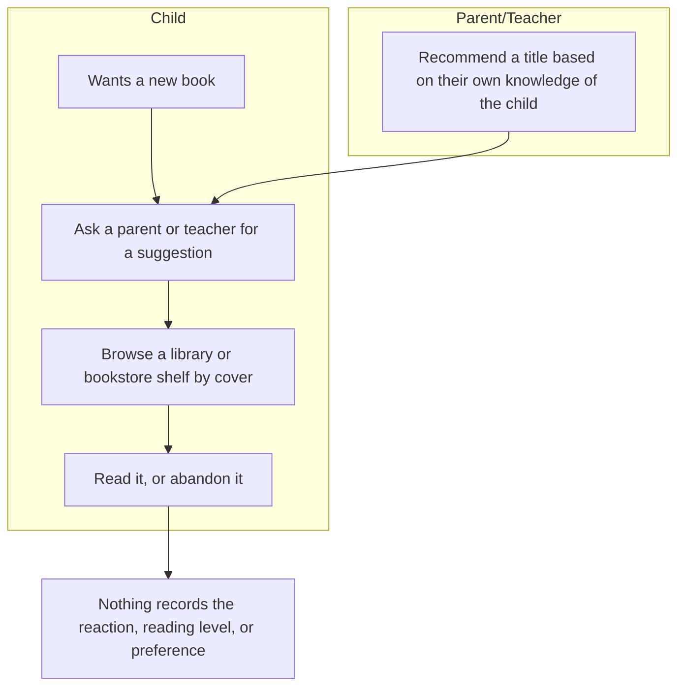
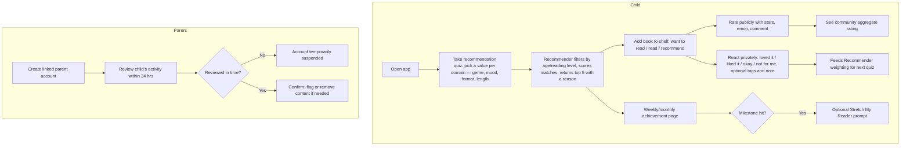
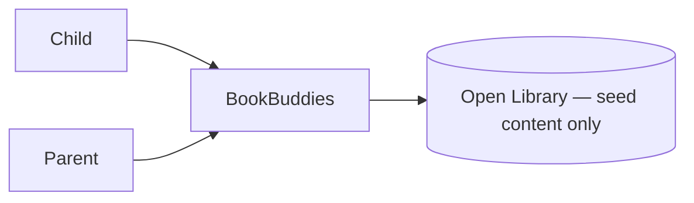

# Vision and Scope
**Project:** BookBuddies
**Team:** 5
**Client:** Yang Yang
**Version:** 0.4

---

## Identifiers in this document

| Space | Shape | Example |
|---|---|---|
| Business objective | `BO-<slug>` | `BO-grading-time` |
| Success metric | `SM-<slug>` | `SM-submission-rate` |
| Risk | `RI-<slug>` | `RI-cloud-cost` |
| Assumption or dependency | `AS-<slug>` | `AS-client-maintains-stack` |
| Feature | `FEAT-<slug>` | `FEAT-performance-tracking` |

## Revision History

| Date | Version | Description | Author |
|---|---|---|---|
| 2026-09-13 | 0.1 | Initial draft from the client brief and first client meeting | Team 05 |
| 2026-09-13 | 0.2 | Filled in Background, Business Requirements, Stakeholder Profiles, and Scope sections from the 2026-09-10 client interview and Yang's 2026-09-12 written follow-up | Team 05 |
| 2026-09-17 | 0.3 | Reconciled the MVP scope table against [OPEN-ISSUES.md](OPEN-ISSUES.md): corrected four features that were listed as both in and out of scope, added `FEAT-ebook-reader` to section 4.2 so it has a definition before section 4.3 excludes it, and updated stale `OI-*` citations | Team 05 |
| 2026-09-23 | 0.4 | Reconciled against Dr. Yang's 2026-09-21 written answers ([BookBuddiesNotes9.21.2026.pdf](BookBuddiesNotes9.21.2026.pdf)) to the team's five questions and the email exchange that prompted them ([Emails.md](Emails.md)). Resolved `OI-1` (Open Library confirmed as the seed-catalog source); resolved the rule-based mechanics behind `OI-2` and reconfirmed Stage 1 (rules only) as the MVP recommender; added `FEAT-recommendation-feedback` as a new in-scope MVP feature (the client's "child feedback loop," one of her top three December-showcase priorities); confirmed the teacher role is *removed* rather than merely deferred; documented the client's proposed System Admin / Catalog-and-Content Admin split against `OI-7`; added the confirmed badge taxonomy against `OI-14`; added two new open technical questions the client raised herself (multi-guardian child-profile architecture; automatic self-harm flagging in private notes); renamed the five MVP area codes to match the client-facing feature-area codes from the team's email (`DSC`→`REC`, `SHF`→`SHLF`, `SOC`→`GRP`, `ACC`→`PAR`; `ADM` unchanged — see [use-cases.md](use-cases.md) section 1.2); and added a December-Showcase-Priority subsection (4.3.1) distinguishing the client's explicit top three from the broader MVP scope | Team 05 |

---

## 1. Introduction

### 1.1 Background

The client, Yang Yang, brought the team an existing concept for **BookBuddies**, a book discovery and tracking app for elementary-age kids (roughly ages 6–11). The concept was presented to the team via slides and a working Shiny app demo before requirements work began. The motivating problem is not a shortage of age-appropriate books — it is that nothing today matches a specific child to books they will actually enjoy, tracks what they have read, or gets better at recommending as it learns their taste. BookBuddies is meant to be kid-powered (the child drives what they read next) but adult-monitored (a linked parent account retains oversight and safety controls).

Dr. Yang's 2026-09-21 written follow-up restates the goals behind this in her own words:

1. Make book discovery more fun and relevant
2. Build kids' agency in choosing books
3. Create opportunities for parent-kid connection
4. Help kids develop a sense of themselves as readers

These map onto the business objectives in section 2.2 below.

### 1.2 Current Process Flows (As-Is Process Flows)

BookBuddies is a green-field product — there is no existing BookBuddies system to replace. The "as-is" process is the informal, tool-less way a child finds a book to read today:

A parent or teacher suggests titles from their own limited knowledge of the child's interests, or the child browses a shelf and picks by cover. No tool tracks what the child has read, liked, or is ready for next, so each recommendation starts from scratch rather than building on the last one.

**Current tools:** word of mouth from parents and teachers; browsing a physical library or bookstore shelf; in some schools, a reading-level test administered by the school itself (see below). None of these are BookBuddies-adjacent software — there is nothing to migrate from.

**Pain points:**
- Recommendations are capped by what the parent or teacher happens to know about the child, not what the child would actually enjoy.
- A formal reading-level baseline often does not exist until school testing catches up — the client noted some schools do not test until 2nd or 3rd grade — so books in the meantime may be pitched at the wrong level.
- Nothing is tracked between one book and the next, so there is no way to see whether a child's taste or level is changing over time.

### 1.3 References

- Client interview notes, 2026-09-10 — `docs/requirements/client-interview-2026-09-10.md`
- Team napkin assessment, undated — `docs/napkin-round-0.md`
- Yang's follow-up design notes ("BookBuddies Profiles"), 2026-09-12 — seed catalog tagging domains, recommender staging, adult- and kid-facing profile scope, and gamification badge concepts — `BookBuddies_Profiles.docx`
- Team's five clarifying questions and Dr. Yang's response, sent by email — `Emails.md`
- Dr. Yang's written answers to those five questions, 2026-09-21 — `BookBuddiesNotes9.21.2026.pdf`. This is now the client's most current and most specific statement on system-admin scope, recommender mechanics, parent/child permissions, gamification, and MVP priority, and supersedes earlier, less specific statements on those points where the two conflict.
- Original concept slide deck — Yang Yang, not yet added to the repo
- Shiny app demo link — Yang Yang, not yet added to the repo

---

## 2. Business Requirements

### 2.1 Business Opportunity or Problem Statement

Elementary-age kids struggle to find books they're excited to read — not because age-appropriate books don't exist, but because nothing matches a specific child's taste, mood, and reading level the way a great librarian or a well-read parent might, and nothing improves as it learns more about that child. Parents and teachers can only point kids toward grade-appropriate titles, which is a blunt instrument. Yang Yang wants BookBuddies to close that gap: a kid-facing app that recommends books a child will actually enjoy, tracks what they've read on a personal shelf, and adds a light social layer (peer picks, small reading groups) — all while giving parents the oversight a product for this age group requires.

### 2.2 Business Objectives

The client has not yet given the team target numbers for these. The objectives below are draft candidates pending client confirmation (`OI-11`). They are grouped against the four goals Dr. Yang restated in her 2026-09-21 follow-up (section 1.1).

- `BO-recommendation-relevance` (DRAFT, traces to goal 1 — "make book discovery more fun and relevant"): Increase the share of quiz-suggested books a child rates positively (e.g., a "loved it" or "liked it" reaction, or 4+ stars) to a target percentage TBD with the client.
- `BO-kid-agency` (DRAFT, NEW, traces to goal 2 — "build kids' agency in choosing books"): Increase the share of a child's shelved books that the child arrived at through their own quiz answers, search, or Buddy Picks choice, rather than a "Suggest a book" push from an adult. Source: `BookBuddiesNotes9.21.2026.pdf`.
- `BO-parent-kid-connection` (DRAFT, NEW, traces to goal 3 — "create opportunities for parent-kid connection"): Increase parent-reported conversations or shared reading moments prompted by the app's recaps or suggestions. This is a distinct objective from `BO-parent-oversight-efficiency` below — "creates a connection moment" and "is quick to review" are two different, non-substitutable things the client asked for, and a design that optimizes only the review-time objective could still fail this one.
- `BO-parent-oversight-efficiency` (DRAFT): Reduce the time a parent spends reviewing a child's activity to complete the 24-hour compliance check, to a target TBD with the client.
- `BO-reader-identity` (DRAFT, NEW, traces to goal 4 — "help kids develop a sense of themselves as readers"): Increase the share of active children who can name at least one earned badge or reading-identity trait when asked. Ties to `FEAT-reading-identity-badges`.
- `BO-book-engagement` (DRAFT): Increase the number of books a child finishes reading per month, relative to before using the app, by a target percentage TBD with the client.

The criteria behind recommendation relevance are now largely resolved — see `FEAT-ai-recommendation` in section 4.2 — but target numbers for every objective above remain open; see `OI-11`.

### 2.3 Success Metrics

These metrics are also drafts pending client confirmation of their target values.

- `SM-quiz-usage` (traces to `BO-recommendation-relevance`): Share of active child accounts that request a new recommendation quiz at least once a week. Baseline: N/A (new product). Target: TBD.
- `SM-shelf-activity` (traces to `BO-book-engagement`): Share of active child accounts that add at least one book to their shelf within their first two weeks. Baseline: N/A. Target: TBD.
- `SM-review-compliance` (traces to `BO-parent-oversight-efficiency`): Share of parent accounts that complete the 24-hour review check without the account being suspended. Baseline: N/A. Target: TBD.
- `SM-badge-earned` (traces to `BO-reader-identity`, NEW): Share of active child accounts that have earned at least one reading-identity badge within 30 days. Baseline: N/A. Target: TBD.

_Note: the illustrative usage-analytics numbers in Dr. Yang's 2026-09-21 notes (e.g., "50 guardian accounts," "130 child profiles," "50% active in past 30 days," "340 badges earned") are example content for the System Admin dashboard mockup (`FEAT-admin-role-segregation`, "Usage Analytics"), not real product data or agreed target numbers. They should not be read as answers to `OI-11` or as a launch baseline — they illustrate the shape of the dashboard, not its numbers._

### 2.4 Vision Statement

| | |
|---|---|
| **For** | elementary-age kids (roughly 6–11) |
| **Who** | want to find books they'll actually enjoy, not just books that are age-appropriate |
| **The** _BookBuddies_ | is a kid-facing app with linked, parent-managed accounts |
| **That** | recommends books through a picture-based quiz and peer activity, tracks what a child reads on a personal shelf, and lets kids form small reading groups with friends or classmates |
| **Unlike** | relying on a parent's or teacher's personal knowledge to suggest books, with nothing tracked or improved over time |
| **Our product** | centers recommendations on what the individual kid enjoys, not just their grade level, while giving parents the safety and review controls this age group requires |

### 2.5 Proposed Process Flows (To-Be Process Flows)

The quiz-driven recommendation (new) replaces the ad hoc adult suggestion from the as-is flow, directly addressing the "recommendations capped by what the adult knows" pain point. The shelf, public rating, and private reaction (all new) replace the "nothing is tracked" pain point — the rating and the reaction are two distinct signals kept separate rather than merged (see `FEAT-recommendation-feedback`). The achievement page (new) gives visibility into reading-level progress that today isn't visible until school testing catches up.

**What stays manual:** the parent retains final say on a child's books — the client was explicit that this does not mean approving every individual choice, but the review-and-flag step is a deliberate, permanent part of the design, not a gap the software is expected to close.

### 2.6 Risks

- `RI-pii-boundary-leak`: A child's identifiable information could reach another user, a group member outside the intended circle, or a system administrator through a support or debug tool, if the anonymous-profile boundary is not enforced at the data layer rather than just in the UI. Given the product handles children's accounts, this is a COPPA-adjacent exposure, not just a bug. (Probability 0.3, Impact 9). Mitigation: segregate PII from admin-visible tables/APIs from the first schema design, not retrofitted later. *Yang's 2026-09-12 design notes sharpen this into two boundaries the system must keep separate: a **data boundary** (the recommender can learn from any registered user's anonymous behavior platform-wide) and a **social boundary** (a child only sees another child's name or picks once both families' adults have approved the connection). Conflating the two — e.g., letting a group-visibility check also gate what the recommender is allowed to learn from — is the likely failure mode. Her 2026-09-21 follow-up adds a system-admin-specific version of this same risk: even a System Admin should not have routine access to a child's identifying info, private notes, or detailed reading activity, only the child-to-guardian link when account support requires it (see `FEAT-admin-role-segregation`; `OI-7`).*
- `RI-review-window-unenforced`: If the 24-hour parental review window is built as a UI reminder instead of a server-enforced suspension workflow, a parent who never opens the app leaves a child's account fully active indefinitely, defeating the control it exists to provide. (Probability 0.3, Impact 7).
- `RI-content-tagging-quality`: If the 30–50 seed books are not tagged consistently for genre, mood, and reading level, the recommendation quiz will feel random to a child regardless of how the matching logic is written. (Probability 0.4, Impact 6).
- `RI-scope-creep-ai`: The "AI-powered" language from the original concept deck could pull the team into building comment/rating sentiment analysis before the core recommendation loop and safety layer are solid, risking a December milestone that doesn't ship a working loop at all. (Probability 0.2 — *lowered from 0.4*, Impact 7). *Update, 2026-09-21: Dr. Yang's own top-three MVP priorities for the December showcase (Working Book Recommender, basic family account structure, and the child feedback loop) explicitly rank a rule-based recommender ahead of AI, and her written mechanics for the recommender describe AI as a fifth stage that runs on top of a working rules engine and a working feedback loop, not a replacement for either. This substantially lowers this risk, though the mitigation below still applies until `OI-2` is formally closed as "Stage 1 is the MVP, full stop."* Mitigation: lock the MVP feature list (section 4.3) with the client and defer AI-driven analysis explicitly.
- `RI-empty-social-layer`: Because part of the value is peer picks and groups, a small initial pilot with too few kids could make the social features feel empty, which in turn reduces the engagement they're meant to drive. (Probability 0.3, Impact 5).
- `RI-multi-guardian-retrofit` (NEW, 2026-09-21): The client has asked whether a child profile can later be associated with more than one authorized adult or context (e.g., a future teacher role, or a second guardian) without restructuring the core database. If the account/profile schema is built as a strict one-parent-to-one-child model now, adding a second adult role later could require a costly data migration. (Probability 0.3, Impact 6). Mitigation: model the child-to-adult relationship as its own join/association table from the first schema design, even though only "guardian/parent" is populated for the MVP, so a second adult role can be added by inserting rows rather than altering tables. See the new open question logged against `AS-teacher-role-deferred` below (recommend filing as `OI-15`).
- `RI-selfharm-detection-gap` (NEW, 2026-09-21): The client has asked whether it is technically possible to automatically flag a child's private note for language suggesting intent to harm themselves or others; today's design relies entirely on a parent noticing this during their 24-hour review, and a note the child chooses not to share is never seen by anyone else at all. (Probability 0.2, Impact 9). Mitigation: treat automatic flagging as a stretch goal — a simple keyword/phrase check, not a clinical judgment — and make sure the Report Function (`BR-parent-content-removal`) stays the primary, always-available path regardless of whether automatic flagging ships. Recommend filing as `OI-16`.

### 2.7 Business Assumptions and Dependencies

- `AS-book-data-source`: **Resolved, 2026-09-21 (closes `OI-1`).** The seed catalog's basic book information (title, author, cover, description, existing genre/subject) is sourced from **Open Library**, the Internet Archive's free book database — not a client-provided dataset, and not the Google Books API the client had floated earlier and was unsure of. BookBuddies then hand-codes a 30–50 book seed set on top of that with its own domains (see `FEAT-book-tagging`).
- `AS-coppa-adjacent-only`: The client wants the system to align with COPPA-adjacent practices as a design discipline, not to pursue formal COPPA compliance or legal certification. If false, the project needs legal review the team is not positioned to provide.
- `AS-email-linking`: Parent accounts are created and linked via email, not phone number, and this is acceptable for the client's expected user base.
- `AS-teacher-role-deferred`: **Confirmed, 2026-09-21 — reworded from "deferred" to "removed."** The client has explicitly asked the team to remove the teacher role for now, not merely postpone it: "I would like to remove 'teacher' for now to keep the project focused and manageable." The account/profile structure for the MVP is System Admin, guardian/parent, and child only. The client separately asked, in the same follow-up, how easily a teacher (or any second authorized adult) could be added back later "without restructuring the core database" — this is a new, team-answerable technical question, not yet logged in `OPEN-ISSUES.md`; recommend filing it as `OI-15` (see `RI-multi-guardian-retrofit` above). Recommended engineering decision: answer it by modeling the child-to-adult relationship as a many-to-many association from the start.

---

## 3. Stakeholder Profiles and User Descriptions

### 3.1 Stakeholder Profiles

| Stakeholder | Major value or benefit from this product | Attitude | Major features of interest | Constraints | End user? |
|---|---|---|---|---|---|
| Child (6–11) | Personalized book discovery and a social reading experience with friends | Likely enthusiastic, but with a short attention span | Quiz, shelf, peer feed, groups, Stretch My Reader | Reading level, any screen-time rules a parent sets, needs a simple/large-tap-target UI | Yes |
| Parent (guardian) | Confidence a child is reading well-matched books, without approving every choice | Supportive if oversight is easy; skeptical if the review burden is heavy | Review dashboard, content flagging, 24-hour compliance, abuse reporting | Limited time to review activity within the 24-hour window | Yes |
| Client (Yang Yang) | Sees the original concept validated with real usage | Supportive; project sponsor and vision owner | Working recommender, basic family account structure, child feedback loop (her stated top-3 December priorities), achievement pages, groups | Availability for recurring syncs; cadence not yet set | No, unless testing |
| Teacher | A potential classroom reading-engagement tool | **Removed from scope at the client's explicit request (2026-09-21), not merely deferred** — "I would like to remove 'teacher' for now to keep the project focused." | Class-based groups, content flagging (future, if reintroduced) | Not implemented; the client asked how cheaply this role could be reintroduced later without a database restructure (`RI-multi-guardian-retrofit`) | No (removed for now) |
| System Admin | Keeps the platform running after the team graduates | Neutral | Roles & permissions, guardian/child account management, system configuration, audit logs, usage analytics, data export/retention | Should not have routine access to a child's identifying info, private notes, or detailed reading activity — only what account management/support needs, per the client's 2026-09-21 permission table (`FEAT-admin-role-segregation`) | No |
| Catalog & Content Admin (NEW, proposed split of System Admin) | Keeps the book catalog, tagging, and recommender rules current without touching family data | Neutral | Book catalog import/export, book metadata, recommender rules, badge/gamification configuration | Per the client's own suggestion, should not receive System Admin access to families and children — recommend adopting this split (`FEAT-admin-role-segregation`) | No |

### 3.2 User Environment

Children are expected to use the app largely at home (evenings and weekends), in short, touch-first sessions of roughly 5–15 minutes — the client's note that the discovery quiz is picture-based (not text-heavy) points to a UI built around large tap targets and minimal reliance on reading to navigate the app itself. Parents check in periodically, at minimum every 24 hours to satisfy the review-window rule, likely from a phone in short gaps between other tasks. There is no existing software this project integrates with today; the one external dependency is Open Library, used as a one-time (or periodically refreshed) source for basic book metadata to build the seed catalog rather than as a live, per-request integration (`AS-book-data-source`).

_**Open issue:** whether BookBuddies needs to be a native mobile app, a mobile-responsive web app, or both has not been specified by the client — see `OI-10`._

### 3.3 Alternatives and Competition

| Alternative | Strengths | Weaknesses for this client |
|---|---|---|
| Status quo — parent/teacher word of mouth and library browsing | Free, uses human judgment, no setup required | No personalization to the individual child's taste; nothing tracked; does not improve over time |
| Goodreads or similar adult-oriented reading trackers | Established rating and tracking model, existing social feed | Built for adults — no reading-level matching, no child-appropriate parental controls, UI and complexity aimed at grown readers |
| School reading-level testing | Produces an official reading level | The client noted this often doesn't start until 2nd or 3rd grade; it measures a level, it doesn't recommend books |

---

## 4. Scope and Limitations

### 4.1 Product Perspective

BookBuddies is a self-contained product: a child-facing app, a parent-facing review dashboard, and a lightweight recommendation engine, all backed by one database. Per the team's napkin assessment, its only external dependency in the MVP is Open Library, used to build the seed catalog — there is no live integration with a school system or LMS in this phase.

### 4.2 Major Features and Scope

- `FEAT-recommendation-quiz`: Give a child book recommendations via a picture-based quiz, run every time they want a new suggestion, not only at onboarding. Per Dr. Yang's 2026-09-21 notes, the child picks a value in each of several domains — **genre** (funny, mystery, adventure, animals, fantasy), **mood** (silly, heartwarming, exciting, spooky-but-safe), **format** (comic/graphic novel, picture book, chapter book), **themes** (friendship, courage, resilience, family, problem-solving, animals), and **length** (quick read, longer story) — rather than a generic "genre/mood" pair.
- `FEAT-ai-recommendation`: Refine recommendations over time using kids' saving/rating/recommending/reacting behavior. Dr. Yang's 2026-09-21 notes give the concrete MVP-relevant mechanism: **(1)** the child picks a value per domain (above); **(2)** the recommender filters out books that clearly don't fit the child's age band or reading level; **(3)** it scores the remaining "applicable" books by counting how many of the child's chosen domain values each book matches (e.g., a book tagged animals + funny + fast-moving scores +2 for each match a child asked for); **(4)** it returns the top 5 scoring books with a one-line plain-language reason ("we picked these because you wanted something funny, fast, and full of animals"). **Stage 1 (steps 1–4 above) is the team's MVP target and one of the client's own top-3 December-showcase priorities ("Working Book Recommender") — see `RI-scope-creep-ai`.** A later stage (**Stage 5** in Dr. Yang's numbering, built on top of `FEAT-recommendation-feedback` below) uses the child's reactions, liked/disliked tags, and optional notes to reweight future scoring for that child, and — per her earlier 2026-09-12 notes — eventually lets an ML model re-rank a rules-narrowed candidate set based on what "similar" kids (by behavior only, never age/location/demographics) saved, loved, or recommended, while still enforcing safety/age-appropriateness filtering. *Both sets of client notes describe the same rules-then-ML trajectory at different levels of detail; the 2026-09-21 notes are the more recent and more specific statement and are treated as authoritative for the MVP's Stage 1 mechanics.*
- `FEAT-book-tagging`: Tag every seed-catalog book in two stages, per Dr. Yang's 2026-09-21 notes. **Stage 1:** pull basic book information — title, author, cover, description, and existing genre/subject — from **Open Library** (`AS-book-data-source`, `OI-1` resolved). **Stage 2:** BookBuddies hand-codes a 30–50 book seed set across genre, mood, format, themes, length, age/interest fit (e.g., 6–8, 7–10, 9–12), and reading level (Lexile or Accelerated Reader, pulled from a source like Scholastic Book Wizard or the publisher), verified by kid readers before launch, so the recommender and search have consistent metadata to work from.
- `FEAT-recommendation-feedback` (NEW, 2026-09-21): Let a child give a private, per-book reaction that feeds the recommender — distinct from the public star rating in `FEAT-ratings` below. The child selects one simple reaction (**loved it / liked it / it was okay / not for me**), optionally picks one or more "what did you like or not like" tags (e.g., funny, exciting, animals, adventure, great characters, too scary, too many words, great pictures), and optionally adds a short free-text note. This is one of the client's three explicit December-showcase priorities ("child feedback loop") and feeds `BR-similarity-signal-weights` directly. *Open question for the team, not yet settled by the client: does this reaction prompt appear immediately after a recommendation-quiz result, after a book is marked "read" on the shelf, or both? The client's notes describe it as happening "after reading or exploring a book," which covers both. Recommended engineering decision: build "react to a book" as one reusable action available from both the recommendation-results screen and the shelf, rather than building it twice.*
- `FEAT-adult-influence-notes`: Let a parent or teacher add a private note about a child (e.g., a growth theme like "building confidence") that quietly biases which books surface for that child, without the underlying note or theme ever being shown to the child.
- `FEAT-group-sharing-controls`: Require adult approval for every member added to a family or classroom reading group, and let a child (via their adult) toggle whether their shared picks show their name or stay anonymous within the group.
- `FEAT-recap-adult`: Give a parent an optional weekly and monthly recap of a child's activity, written as a short qualitative snapshot (what caught their attention, a notable first) rather than a count, streak, or comparison to other kids.
- `FEAT-reading-identity-badges`: Give a child identity-based badges that reflect their reading taste, exploration, and generosity in recommending to peers — never a count, level, or comparison to other kids. **Taxonomy confirmed, 2026-09-21 (substantially resolves `OI-14`, though the client still calls exact edge cases "forming/underway"):** three badge types, each unlocked after three meaningful interactions (save/read/like) in the matching pattern — **Interest/Genre** (repeated engagement with a topic, e.g., "Animal Explorer" after saving, reading, and liking three animal-tagged books), **Exploration** (tries books outside usual preferences, e.g., "Genre Traveler" after trying a mystery, a space book, and a fantasy book when the child usually picks funny animal books), and **Creator** (uses a book as inspiration for the child's own idea/story/drawing, e.g., "Story Maker").
- `FEAT-achievement-pages` **(WITHDRAWN)**: Originally, a Duolingo-style page showing a child's weekly/monthly books, genres, and reading-level progress. Dr. Yang's 2026-09-12 notes explicitly rule out showing a child their reading level, book/page counts, streaks, or peer comparisons — which conflicts with this feature as first described in the 2026-09-10 interview. Retired in favor of `FEAT-reading-identity-badges` (child-facing) and `FEAT-recap-adult` (parent-facing). *See `OI-6` — confirm this reading with the client before treating it as settled; the 2026-09-21 notes do not revisit this specific conflict.*
- `FEAT-shelf`: Let a child archive books as want-to-read, read, or recommend.
- `FEAT-peer-feed`: Show a child what friends and classmates are reading, within an adult-approved reading group (also called "Buddy Picks" — see project-glossary.md).
- `FEAT-manual-search`: Let a child search the catalog by keyword.
- `FEAT-ratings`: Let a child rate a book with stars, emoji, and a comment; show the aggregate community rating. **Distinct from `FEAT-recommendation-feedback` above:** a star rating is a public, book-level community signal, while a reaction is a private, per-child signal that feeds the recommender's weighting. `BR-similarity-signal-weights` lists "loved it" and "rated highly" as two separate weighted signals, so the product should keep both mechanisms rather than merging them.
- `FEAT-groups`: Let kids form or join reading groups of 2–20 members, without needing a teacher to create the group.
- `FEAT-stretch-my-reader`: Offer optional, opt-in prompts toward higher-reading-level books, tied to achievement milestones.
- `FEAT-reading-level-baseline`: Establish a child's reading level with an in-app test at account creation, rather than a parent's self-report.
- `FEAT-parent-account-linking`: Link a parent account to one or more child accounts, with the parent creating the account first.
- `FEAT-parent-review-dashboard`: Let a parent review a child's books and comments, remove flagged content, and report abuse or self-harm signals, inside a 24-hour compliance window.
- `FEAT-admin-role-segregation` (RENAMED and expanded from `FEAT-admin-pii-segregation`, 2026-09-21): Ensure system administration cannot expose a child's or family's personal information beyond what account management requires. Dr. Yang's 2026-09-21 notes propose splitting this into two roles and provide a permission matrix (View/Create/Edit/Delete per module) for each:
  - **System Admin** (platform-wide): roles & permissions, guardian/parent and child profile administration, system configuration, notifications, audit logs, usage analytics, data export, and data retention. Even here, the client's stated intent is that routine access is limited to what account management and technical support need — a System Admin can see that a child profile is linked to a given guardian when troubleshooting, but should not have routine access to the child's identifying info, private notes, or detailed reading activity (`BR-admin-no-pii` still applies as the narrower, harder rule inside this broader role).
  - **Catalog & Content Admin**: book catalog (bulk import/export), book metadata, recommender rules, and badge/gamification configuration — with no access to guardian or child profile data at all.

  Recommended engineering decision: adopt this two-role split, since it strictly reduces the number of roles with routine access to family data and the client proposed it herself. Whether full PII-blindness for the System Admin role (not just the Catalog & Content Admin split) is technically feasible as a hard constraint remains open — the client asked the team this question directly; see `OI-7`.
- `FEAT-teacher-flagging` **(REMOVED FOR NOW — reworded 2026-09-21 from "deferred/stretch goal")**: Would let a teacher flag content as age-inappropriate, without the ability to restrict books outright. The client has asked the team to remove the teacher role entirely for the current phase, not just keep it as a future stretch goal, "to keep the project focused and manageable" (`AS-teacher-role-deferred`).
- `FEAT-ebook-reader`: Not part of the product. The client concept brief is explicit that BookBuddies is recommendation, tracking, and social sharing only, not an ebook reader — a child reads the book itself elsewhere (library, bookstore, home). Listed here, and excluded in section 4.3, so the boundary is on the record rather than assumed.

### 4.3 MVP Scope

**In scope for the MVP:** `FEAT-recommendation-quiz`, `FEAT-recommendation-feedback`, `FEAT-shelf`, `FEAT-ratings`, `FEAT-manual-search`, `FEAT-reading-level-baseline`, `FEAT-parent-account-linking`, `FEAT-parent-review-dashboard`, `FEAT-admin-role-segregation`, `FEAT-peer-feed`, `FEAT-groups`

_A prior revision of this section also listed four of the ten originally-scoped features (`FEAT-groups`, `FEAT-parent-account-linking`, `FEAT-parent-review-dashboard`, `FEAT-reading-level-baseline`) as explicitly out of scope below, citing open questions about their exact details. That was a drafting error, not a decision to cut them: a feature whose exact behavior is still being confirmed belongs in scope with an open issue attached, not in both lists at once. They are in scope; the open questions that still bound their detailed design are listed against each one below and tracked in [OPEN-ISSUES.md](OPEN-ISSUES.md). `FEAT-recommendation-feedback` is newly added to this list, 2026-09-21 — see section 4.2._

#### 4.3.1 December Showcase Priority (client-specified, 2026-09-21)

The MVP above is the full agreed feature set, but Dr. Yang's 2026-09-21 follow-up separately names **her own top three priorities specifically for the December MVP showcase** — narrower than, and a sequencing guide within, the ten-feature MVP list above, not a replacement for it:

1. **Working Book Recommender** — a child selects basic interests (the domain values in `FEAT-recommendation-quiz`) and receives a basic, rule-based recommendation list (`FEAT-ai-recommendation` Stage 1 only).
2. **Basic family account structure** — a parent and at least one linked child account (`FEAT-parent-account-linking`).
3. **Child feedback loop** — a child can react to the recommender's list with loved it / liked it / it was okay / not for me (`FEAT-recommendation-feedback`).

Recommendation for the team: sequence engineering work so these three are demonstrably working end-to-end first, then layer in the remaining in-scope MVP features (`FEAT-ratings`, `FEAT-manual-search`, `FEAT-peer-feed`, `FEAT-groups`, `FEAT-admin-role-segregation`) — all of which remain agreed MVP scope, just not the client's stated showcase-day priority order.

**Explicitly out of scope for the MVP:**
- `FEAT-ai-recommendation` (deferred to a later release, beyond Stage 1): Refine recommendations using children's saving, rating, recommending, and reacting behavior via ML re-ranking (Stages 2+ in section 4.2). Stage 1 (rules only) is in scope and is the client's own top MVP priority; whether the MVP needs anything beyond Stage 1 is still open — see `OI-2`.
- `FEAT-book-tagging` (deferred to a later release, beyond the minimum tagging the MVP quiz needs): Tag books by genre, mood, format, themes, length, age fit, and reading level beyond what Stage 1 scoring requires. The book-data source itself is now resolved (Open Library — `OI-1` closed).
- `FEAT-ebook-reader` (confirmed out of scope, not deferred): the client concept brief rules this out entirely — see the entry in section 4.2.
- `FEAT-teacher-flagging` (**removed for now**, not merely a deferred stretch goal — see section 4.2): the client asked the team to drop the teacher role entirely to keep the current phase focused.

_The four features moved back into the in-scope list above (`FEAT-groups`, `FEAT-parent-account-linking`, `FEAT-parent-review-dashboard`, `FEAT-reading-level-baseline`) were flagged against `OI-1` through `OI-6` in an earlier revision of this document, before those issues were reconciled against the 2026-09-10 meeting transcript and Yang's written follow-ups (see [OPEN-ISSUES.md](OPEN-ISSUES.md)). The group-vs-school question (`OI-4`) and the parent/teacher authority question (`OI-5`) are resolved, so `FEAT-groups` and `FEAT-parent-review-dashboard` ship in the MVP without a remaining open question. `FEAT-parent-account-linking` still depends on `OI-8` (whether a parent account must exist before a child account can be created). `FEAT-reading-level-baseline` still depends on `OI-6`, but only on the narrower question of whether the resulting level is ever shown to the child — the capture method (an in-app baseline test at account creation) is settled. `FEAT-stretch-my-reader` remains genuinely deferred for the same reason: it is built on showing a level-based prompt, so it cannot be finalized until `OI-6` closes._

### 4.4 Deployment Considerations

_Not yet written._
