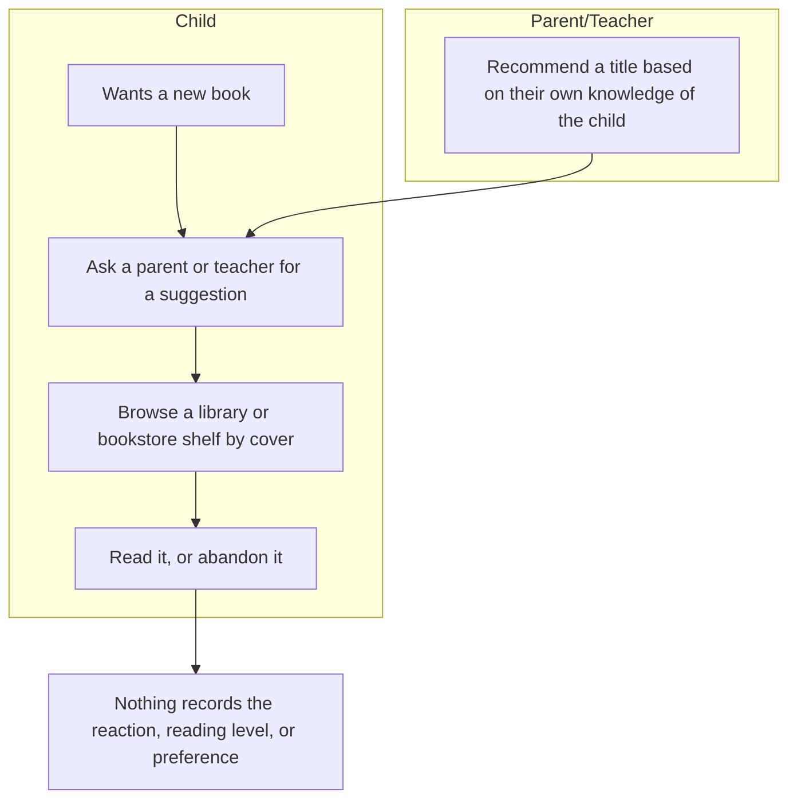
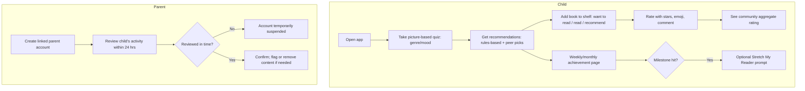
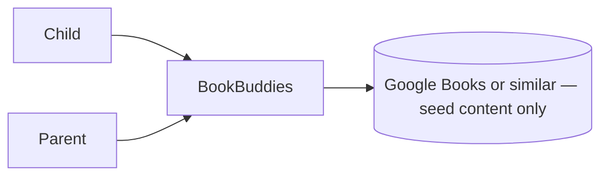

# Vision and Scope
**Project:** BookBuddies
**Team:** 5
**Client:** Yang Yang
**Version:** 0.3

---

## Identifiers in this document

| Space | Shape | Example |
|---|---|---|
| Business objective | `BO-<slug>` | `BO-grading-time` |
| Success metric | `SM-<slug>` | `SM-submission-rate` |
| Risk | `RI-<slug>` | `RI-cloud-cost` |
| Assumption or dependency | `AS-<slug>` | `AS-client-maintains-stack` |
| Feature | `FEAT-<slug>` | `FEAT-performance-tracking` |

## Revision History

| Date | Version | Description | Author |
|---|---|---|---|
| 2026-09-13 | 0.1 | Initial draft from the client brief and first client meeting | Team 05 |
| 2026-09-13 | 0.2 | Filled in Background, Business Requirements, Stakeholder Profiles, and Scope sections from the 2026-09-10 client interview and Yang's 2026-09-12 written follow-up | Team 05 |
| 2026-09-17 | 0.3 | Reconciled the MVP scope table against [OPEN-ISSUES.md](OPEN-ISSUES.md): corrected four features that were listed as both in and out of scope, added `FEAT-ebook-reader` to section 4.2 so it has a definition before section 4.3 excludes it, and updated stale `OI-*` citations | Team 05 |

---

## 1. Introduction

### 1.1 Background

The client, Yang Yang, brought the team an existing concept for **BookBuddies**, a book discovery and tracking app for elementary-age kids (roughly ages 6–11). The concept was presented to the team via slides and a working Shiny app demo before requirements work began. The motivating problem is not a shortage of age-appropriate books — it is that nothing today matches a specific child to books they will actually enjoy, tracks what they have read, or gets better at recommending as it learns their taste. BookBuddies is meant to be kid-powered (the child drives what they read next) but adult-monitored (a linked parent account retains oversight and safety controls).

### 1.2 Current Process Flows (As-Is Process Flows)

BookBuddies is a green-field product — there is no existing BookBuddies system to replace. The "as-is" process is the informal, tool-less way a child finds a book to read today:

A parent or teacher suggests titles from their own limited knowledge of the child's interests, or the child browses a shelf and picks by cover. No tool tracks what the child has read, liked, or is ready for next, so each recommendation starts from scratch rather than building on the last one.

**Current tools:** word of mouth from parents and teachers; browsing a physical library or bookstore shelf; in some schools, a reading-level test administered by the school itself (see below). None of these are BookBuddies-adjacent software — there is nothing to migrate from.

**Pain points:**
- Recommendations are capped by what the parent or teacher happens to know about the child, not what the child would actually enjoy.
- A formal reading-level baseline often does not exist until school testing catches up — the client noted some schools do not test until 2nd or 3rd grade — so books in the meantime may be pitched at the wrong level.
- Nothing is tracked between one book and the next, so there is no way to see whether a child's taste or level is changing over time.

### 1.3 References

- Client interview notes, 2026-09-10 — `docs/requirements/client-interview-2026-09-10.md`
- Team napkin assessment, undated — `docs/napkin-round-0.md`
- Yang's follow-up design notes ("BookBuddies Profiles"), 2026-09-12 — seed catalog tagging domains, recommender staging, adult- and kid-facing profile scope, and gamification badge concepts. Not yet added to the repo — add alongside this revision.
- Original concept slide deck — Yang Yang, not yet added to the repo
- Shiny app demo link — Yang Yang, not yet added to the repo

---

## 2. Business Requirements

### 2.1 Business Opportunity or Problem Statement

Elementary-age kids struggle to find books they're excited to read — not because age-appropriate books don't exist, but because nothing matches a specific child's taste, mood, and reading level the way a great librarian or a well-read parent might, and nothing improves as it learns more about that child. Parents and teachers can only point kids toward grade-appropriate titles, which is a blunt instrument. Yang Yang wants BookBuddies to close that gap: a kid-facing app that recommends books a child will actually enjoy, tracks what they've read on a personal shelf, and adds a light social layer (peer picks, small reading groups) — all while giving parents the oversight a product for this age group requires.

### 2.2 Business Objectives

The client has not yet given the team target numbers for these. The objectives below are draft candidates pending client confirmation. The criteria behind recommendation relevance also remain unresolved (see `OI-2`).

- `BO-book-engagement` (DRAFT): Increase the number of books a child finishes reading per month, relative to before using the app, by a target percentage TBD with the client.
- `BO-recommendation-relevance` (DRAFT): Increase the share of quiz/AI-suggested books a child rates positively (e.g., 4+ stars or a "loved it" reaction) to a target percentage TBD with the client.
- `BO-parent-oversight-efficiency` (DRAFT): Reduce the time a parent spends reviewing a child's activity to complete the 24-hour compliance check, to a target TBD with the client.

### 2.3 Success Metrics

These metrics are also drafts pending client confirmation of their target values.

- `SM-quiz-usage` (traces to `BO-recommendation-relevance`): Share of active child accounts that request a new recommendation quiz at least once a week. Baseline: N/A (new product). Target: TBD.
- `SM-shelf-activity` (traces to `BO-book-engagement`): Share of active child accounts that add at least one book to their shelf within their first two weeks. Baseline: N/A. Target: TBD.
- `SM-review-compliance` (traces to `BO-parent-oversight-efficiency`): Share of parent accounts that complete the 24-hour review check without the account being suspended. Baseline: N/A. Target: TBD.

### 2.4 Vision Statement

| | |
|---|---|
| **For** | elementary-age kids (roughly 6–11) |
| **Who** | want to find books they'll actually enjoy, not just books that are age-appropriate |
| **The** _BookBuddies_ | is a kid-facing app with linked, parent-managed accounts |
| **That** | recommends books through a picture-based quiz and peer activity, tracks what a child reads on a personal shelf, and lets kids form small reading groups with friends or classmates |
| **Unlike** | relying on a parent's or teacher's personal knowledge to suggest books, with nothing tracked or improved over time |
| **Our product** | centers recommendations on what the individual kid enjoys, not just their grade level, while giving parents the safety and review controls this age group requires |

### 2.5 Proposed Process Flows (To-Be Process Flows)

The quiz-driven recommendation (new) replaces the ad hoc adult suggestion from the as-is flow, directly addressing the "recommendations capped by what the adult knows" pain point. The shelf and ratings (new) replace the "nothing is tracked" pain point. The achievement page (new) gives visibility into reading-level progress that today isn't visible until school testing catches up.

**What stays manual:** the parent retains final say on a child's books — the client was explicit that this does not mean approving every individual choice, but the review-and-flag step is a deliberate, permanent part of the design, not a gap the software is expected to close.

### 2.6 Risks

- `RI-pii-boundary-leak`: A child's identifiable information could reach another user, a group member outside the intended circle, or the system admin through a support or debug tool, if the anonymous-profile boundary is not enforced at the data layer rather than just in the UI. Given the product handles children's accounts, this is a COPPA-adjacent exposure, not just a bug. (Probability 0.3, Impact 9). Mitigation: segregate PII from admin-visible tables/APIs from the first schema design, not retrofitted later. *Yang's 2026-09-12 design notes sharpen this into two boundaries the system must keep separate: a **data boundary** (the recommender can learn from any registered user's anonymous behavior platform-wide) and a **social boundary** (a child only sees another child's name or picks once both families' adults have approved the connection). Conflating the two — e.g., letting a group-visibility check also gate what the recommender is allowed to learn from — is the likely failure mode.*
- `RI-review-window-unenforced`: If the 24-hour parental review window is built as a UI reminder instead of a server-enforced suspension workflow, a parent who never opens the app leaves a child's account fully active indefinitely, defeating the control it exists to provide. (Probability 0.3, Impact 7).
- `RI-content-tagging-quality`: If the 30–50 seed books are not tagged consistently for genre, mood, and reading level, the recommendation quiz will feel random to a child regardless of how the matching logic is written. (Probability 0.4, Impact 6).
- `RI-scope-creep-ai`: The "AI-powered" language from the original concept deck could pull the team into building comment/rating sentiment analysis before the core recommendation loop and safety layer are solid, risking a December milestone that doesn't ship a working loop at all. (Probability 0.4, Impact 7). Mitigation: lock the MVP feature list (section 4.3) with the client and defer AI-driven analysis explicitly.
- `RI-empty-social-layer`: Because part of the value is peer picks and groups, a small initial pilot with too few kids could make the social features feel empty, which in turn reduces the engagement they're meant to drive. (Probability 0.3, Impact 5).

### 2.7 Business Assumptions and Dependencies

- `AS-book-data-source`: The initial 30–50 book seed catalog can be sourced and tagged using a client-provided dataset or an external book-data source. The source is unresolved (see `OI-1`); if neither is available, the recommendation quiz has nothing to recommend from.
- `AS-coppa-adjacent-only`: The client wants the system to align with COPPA-adjacent practices as a design discipline, not to pursue formal COPPA compliance or legal certification. If false, the project needs legal review the team is not positioned to provide.
- `AS-email-linking`: Parent accounts are created and linked via email, not phone number, and this is acceptable for the client's expected user base.
- `AS-teacher-role-deferred`: Teachers remain a stretch goal; the MVP does not need class-roster management or teacher-level content restriction.

---

## 3. Stakeholder Profiles and User Descriptions

### 3.1 Stakeholder Profiles

| Stakeholder | Major value or benefit from this product | Attitude | Major features of interest | Constraints | End user? |
|---|---|---|---|---|---|
| Child (6–11) | Personalized book discovery and a social reading experience with friends | Likely enthusiastic, but with a short attention span | Quiz, shelf, peer feed, groups, Stretch My Reader | Reading level, any screen-time rules a parent sets, needs a simple/large-tap-target UI | Yes |
| Parent | Confidence a child is reading well-matched books, without approving every choice | Supportive if oversight is easy; skeptical if the review burden is heavy | Review dashboard, content flagging, 24-hour compliance, abuse reporting | Limited time to review activity within the 24-hour window | Yes |
| Client (Yang Yang) | Sees the original concept validated with real usage | Supportive; project sponsor and vision owner | AI-powered recommendations, achievement pages, groups | Availability for recurring syncs; cadence not yet set | No, unless testing |
| Teacher (future/deferred) | A potential classroom reading-engagement tool | Unaware — out of scope for now | Class-based groups, content flagging | Not implemented in the MVP | Deferred |
| System admin / future maintainer | Keeps the system running after the team graduates | Neutral | PII segregation, deployment simplicity | Must never see PII, per client requirement; identity of the post-graduation maintainer is unknown | No |

### 3.2 User Environment

Children are expected to use the app largely at home (evenings and weekends), in short, touch-first sessions of roughly 5–15 minutes — the client's note that the discovery quiz is picture-based (not text-heavy) points to a UI built around large tap targets and minimal reliance on reading to navigate the app itself. Parents check in periodically, at minimum every 24 hours to satisfy the review-window rule, likely from a phone in short gaps between other tasks. There is no existing software this project integrates with today; the one external dependency is a book-metadata source (Google Books or similar) used once, up front, to build the seed catalog rather than as a live integration.

_**Open issue:** whether BookBuddies needs to be a native mobile app, a mobile-responsive web app, or both has not been specified by the client — see `OI-10`._

### 3.3 Alternatives and Competition

| Alternative | Strengths | Weaknesses for this client |
|---|---|---|
| Status quo — parent/teacher word of mouth and library browsing | Free, uses human judgment, no setup required | No personalization to the individual child's taste; nothing tracked; does not improve over time |
| Goodreads or similar adult-oriented reading trackers | Established rating and tracking model, existing social feed | Built for adults — no reading-level matching, no child-appropriate parental controls, UI and complexity aimed at grown readers |
| School reading-level testing | Produces an official reading level | The client noted this often doesn't start until 2nd or 3rd grade; it measures a level, it doesn't recommend books |

---

## 4. Scope and Limitations

### 4.1 Product Perspective

BookBuddies is a self-contained product: a child-facing app, a parent-facing review dashboard, and a lightweight recommendation engine, all backed by one database. Per the team's napkin assessment, its only external dependency in the MVP is a book-metadata source used to build the seed catalog — there is no live integration with a school system or LMS in this phase.

### 4.2 Major Features and Scope

- `FEAT-recommendation-quiz`: Give a child book recommendations via a picture-based quiz on genre and mood, run every time they want a new suggestion, not only at onboarding.
- `FEAT-ai-recommendation`: Refine recommendations over time using kids' saving/rating/recommending behavior. Per Yang's 2026-09-12 notes, this rolls out in three stages: **(1)** a rules engine filters the tagged seed catalog by mood/length and returns the top matches; **(2)** the same rules engine narrows to a candidate set, and an ML model re-ranks it using what "similar" kids (by behavior only — never age, location, or other demographics) saved, loved, or recommended; **(3)** the model starts finding non-obvious matches the tags never captured, while still enforcing safety/age-appropriateness filtering. *(Stage 1 is the team's realistic MVP target; see `RI-scope-creep-ai`.)*
- `FEAT-book-tagging`: Tag every seed-catalog book across genre, mood, format, themes, length, age fit, and reading level (Lexile/AR), verified by kid readers before launch, so the recommender and search have consistent metadata to work from.
- `FEAT-adult-influence-notes`: Let a parent or teacher add a private note about a child (e.g., a growth theme like "building confidence") that quietly biases which books surface for that child, without the underlying note or theme ever being shown to the child.
- `FEAT-group-sharing-controls`: Require adult approval for every member added to a family or classroom reading group, and let a child (via their adult) toggle whether their shared picks show their name or stay anonymous within the group.
- `FEAT-recap-adult`: Give a parent an optional weekly and monthly recap of a child's activity, written as a short qualitative snapshot (what caught their attention, a notable first) rather than a count, streak, or comparison to other kids.
- `FEAT-reading-identity-badges`: Give a child identity-based badges (e.g., "Mystery Fan," "Great Recommender") that reflect their reading taste, exploration, and generosity in recommending to peers — never a count, level, or comparison to other kids. *(Badge design is explicitly still forming per Yang's notes)*
- `FEAT-achievement-pages` **(WITHDRAWN)**: Originally, a Duolingo-style page showing a child's weekly/monthly books, genres, and reading-level progress. Yang's 2026-09-12 notes explicitly rule out showing a child their reading level, book/page counts, streaks, or peer comparisons — which conflicts with this feature as first described in the 2026-09-10 interview. Retired in favor of `FEAT-reading-identity-badges` (child-facing) and `FEAT-recap-adult` (parent-facing). *See `OI-6` — confirm this reading with the client before treating it as settled.*
- `FEAT-shelf`: Let a child archive books as want-to-read, read, or recommend.
- `FEAT-peer-feed`: Show a child what friends and classmates are reading.
- `FEAT-manual-search`: Let a child search the catalog by keyword.
- `FEAT-ratings`: Let a child rate a book with stars, emoji, and a comment; show the aggregate community rating.
- `FEAT-groups`: Let kids form or join reading groups of 2–20 members, without needing a teacher to create the group.
- `FEAT-stretch-my-reader`: Offer optional, opt-in prompts toward higher-reading-level books, tied to achievement milestones.
- `FEAT-reading-level-baseline`: Establish a child's reading level with an in-app test at account creation, rather than a parent's self-report.
- `FEAT-parent-account-linking`: Link a parent account to one or more child accounts, with the parent creating the account first.
- `FEAT-parent-review-dashboard`: Let a parent review a child's books and comments, remove flagged content, and report abuse or self-harm signals, inside a 24-hour compliance window.
- `FEAT-admin-pii-segregation`: Ensure the system admin role cannot view personally identifiable information for any account.
- `FEAT-teacher-flagging`: Let a teacher flag content as age-inappropriate, without the ability to restrict books outright. *(Stretch goal only — the client scoped the current phase to parents.)*
- `FEAT-ebook-reader`: Not part of the product. The client concept brief is explicit that BookBuddies is recommendation, tracking, and social sharing only, not an ebook reader — a child reads the book itself elsewhere (library, bookstore, home). Listed here, and excluded in section 4.3, so the boundary is on the record rather than assumed.

### 4.3 MVP Scope

**In scope for the MVP:** `FEAT-recommendation-quiz`, `FEAT-shelf`, `FEAT-ratings`, `FEAT-manual-search`, `FEAT-reading-level-baseline`, `FEAT-parent-account-linking`, `FEAT-parent-review-dashboard`, `FEAT-admin-pii-segregation`, `FEAT-peer-feed`, `FEAT-groups`

_A prior revision of this section also listed four of these ten features (`FEAT-groups`, `FEAT-parent-account-linking`, `FEAT-parent-review-dashboard`, `FEAT-reading-level-baseline`) as explicitly out of scope below, citing open questions about their exact details. That was a drafting error, not a decision to cut them: a feature whose exact behavior is still being confirmed belongs in scope with an open issue attached, not in both lists at once. They are in scope; the open questions that still bound their detailed design are listed against each one below and tracked in [OPEN-ISSUES.md](OPEN-ISSUES.md)._

**Explicitly out of scope for the MVP:**
- `FEAT-ai-recommendation` (deferred to a later release): Refine recommendations over time using children's saving, rating, and recommending behavior. Stage 1 mechanics are now documented (see `FEAT-ai-recommendation` above and `BR-similarity-signal-weights`); whether the MVP itself needs AI on day one, versus the team's rule-based Stage 1, is still open — see `OI-2`.
- `FEAT-book-tagging` (deferred to a later release): Tag books by genre, mood, format, themes, length, age fit, and reading level, beyond the minimum tagging the MVP's rule-based quiz needs. The book-data source is still unresolved (see `OI-1`).
- `FEAT-ebook-reader` (confirmed out of scope, not deferred): the client concept brief rules this out entirely — see the entry in section 4.2.
- `FEAT-teacher-flagging` (deferred; stretch goal): the client scoped the current phase to parents only.

_The four features moved back into the in-scope list above (`FEAT-groups`, `FEAT-parent-account-linking`, `FEAT-parent-review-dashboard`, `FEAT-reading-level-baseline`) were flagged against `OI-1` through `OI-6` in an earlier revision of this document, before those issues were reconciled against the 2026-09-10 meeting transcript and Yang's written follow-up (see [OPEN-ISSUES.md](OPEN-ISSUES.md)). The group-vs-school question (`OI-4`) and the parent/teacher authority question (`OI-5`) are now resolved, so `FEAT-groups` and `FEAT-parent-review-dashboard` ship in the MVP without a remaining open question. `FEAT-parent-account-linking` still depends on `OI-8` (whether a parent account must exist before a child account can be created). `FEAT-reading-level-baseline` still depends on `OI-6`, but only on the narrower question of whether the resulting level is ever shown to the child — the capture method (an in-app baseline test at account creation) is settled. `FEAT-stretch-my-reader` remains genuinely deferred for the same reason: it is built on showing a level-based prompt, so it cannot be finalized until `OI-6` closes._

### 4.4 Deployment Considerations

_Not yet written._
