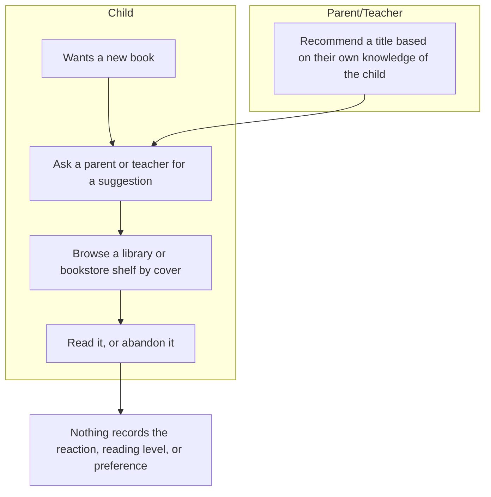
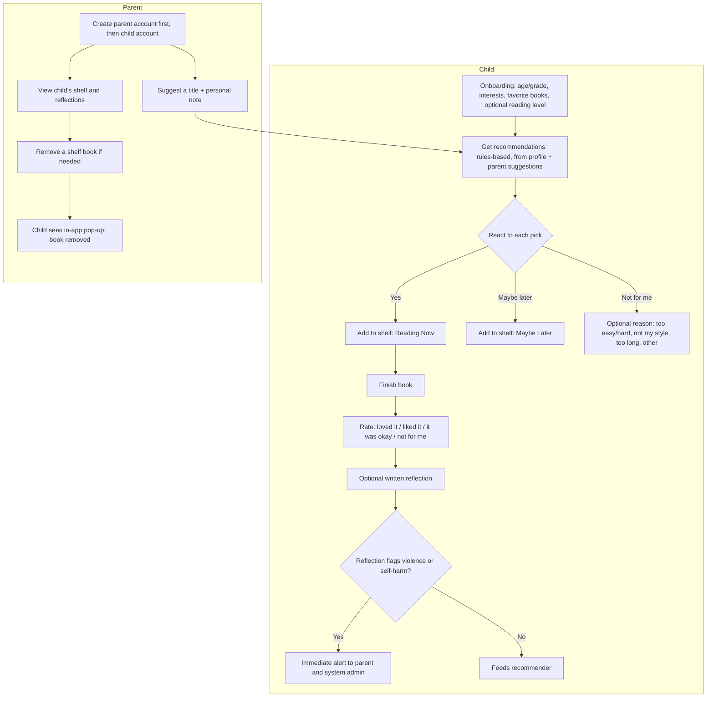
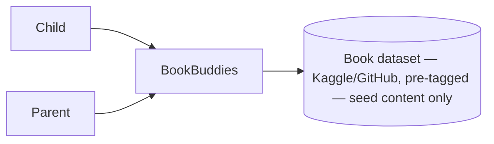

# Vision and Scope
**Project:** BookBuddies
**Team:** 5
**Client:** Yang Yang
**Version:** 0.4

---

## Identifiers in this document

| Space | Shape | Example |
|---|---|---|
| Business objective | `BO-<slug>` | `BO-grading-time` |
| Success metric | `SM-<slug>` | `SM-submission-rate` |
| Risk | `RI-<slug>` | `RI-cloud-cost` |
| Assumption or dependency | `AS-<slug>` | `AS-client-maintains-stack` |
| Feature | `FEAT-<slug>` | `FEAT-performance-tracking` |

## Revision History

| Date | Version | Description | Author |
|---|---|---|---|
| 2026-09-13 | 0.1 | Initial draft from the client brief and first client meeting | Team 05 |
| 2026-09-13 | 0.2 | Filled in Background, Business Requirements, Stakeholder Profiles, and Scope sections from the 2026-09-10 client interview and Dr. Yang's 2026-09-12 written follow-up | Team 05 |
| 2026-09-17 | 0.3 | Reconciled the MVP scope table against [OPEN-ISSUES.md](OPEN-ISSUES.md): corrected four features that were listed as both in and out of scope, added `FEAT-ebook-reader` to section 4.2 so it has a definition before section 4.3 excludes it, and updated stale `OI-*` citations | Team 05 |
| 2026-09-25 | 0.4 | Applied the 2026-09-24 client meeting and follow-up flowchart: withdrew `FEAT-peer-feed`, `FEAT-groups`, `FEAT-group-sharing-controls`, `FEAT-stretch-my-reader`, `FEAT-reading-level-baseline`, `FEAT-teacher-flagging`; added `FEAT-onboarding-profile`, `FEAT-kid-reflections`, `FEAT-parent-suggest-book`, `FEAT-reading-level-input`; updated the shelf categories, MVP scope, vision statement, to-be flow, risks, assumptions, and stakeholder table; opened `OI-15` through `OI-18` for new contradictions this round surfaced | Tam Nguyen |

---

## 1. Introduction

### 1.1 Background

The client, Dr. Yang, brought the team an existing concept for **BookBuddies**, a book discovery and tracking app for elementary-age kids (roughly ages 6–11). The concept was presented to the team via slides and a working Shiny app demo before requirements work began. The motivating problem is not a shortage of age-appropriate books — it is that nothing today matches a specific child to books they will actually enjoy, tracks what they have read, or gets better at recommending as it learns their taste. BookBuddies is meant to be kid-powered (the child drives what they read next) but adult-monitored (a linked parent account retains oversight and safety controls).

### 1.2 Current Process Flows (As-Is Process Flows)

BookBuddies is a green-field product — there is no existing BookBuddies system to replace. The "as-is" process is the informal, tool-less way a child finds a book to read today:

```mermaid
flowchart TD
  subgraph Child
    A[Wants a new book] --> B[Ask a parent or teacher for a suggestion]
    B --> C[Browse a library or bookstore shelf by cover]
    C --> E[Read it, or abandon it]
  end
  subgraph Parent/Teacher
    D[Recommend a title based on their own knowledge of the child] --> B
  end
  E --> F[Nothing records the reaction, reading level, or preference]
```

A parent or teacher suggests titles from their own limited knowledge of the child's interests, or the child browses a shelf and picks by cover. No tool tracks what the child has read, liked, or is ready for next, so each recommendation starts from scratch rather than building on the last one.

**Current tools:** word of mouth from parents and teachers; browsing a physical library or bookstore shelf; in some schools, a reading-level test administered by the school itself (see below). None of these are BookBuddies-adjacent software — there is nothing to migrate from.

**Pain points:**
- Recommendations are capped by what the parent or teacher happens to know about the child, not what the child would actually enjoy.
- A formal reading-level baseline often does not exist until school testing catches up — the client noted some schools do not test until 2nd or 3rd grade — so books in the meantime may be pitched at the wrong level.
- Nothing is tracked between one book and the next, so there is no way to see whether a child's taste or level is changing over time.

### 1.3 References

- Client interview notes, 2026-09-10 — `docs/requirements/client-interview-2026-09-10.md`
- Team napkin assessment, undated — `docs/napkin-round-0.md`
- Dr. Yang's follow-up design notes ("BookBuddies Profiles"), 2026-09-12 — seed catalog tagging domains, recommender staging, adult- and kid-facing profile scope, and gamification badge concepts. Not yet added to the repo — add alongside this revision.
- Client meeting notes, 2026-09-24, plus Dr. Yang's follow-up flowchart (PPTX + PNG) — `docs/external/client-meeting-2026-09-24.md`. Drops the teacher role, in-app reading test, peer feed/groups, and Stretch My Reader from the 2026-09-10/09-12 material; this revision reflects those cuts. Two internal contradictions from this round remain open — see `OI-15` and `OI-16`.
- Original concept slide deck — Dr. Yang, not yet added to the repo
- Shiny app demo link — Dr. Yang, not yet added to the repo

---

## 2. Business Requirements

### 2.1 Business Opportunity or Problem Statement

Elementary-age kids struggle to find books they're excited to read — not because age-appropriate books don't exist, but because nothing matches a specific child's taste, mood, and reading level the way a great librarian or a well-read parent might, and nothing improves as it learns more about that child. Parents and teachers can only point kids toward grade-appropriate titles, which is a blunt instrument. Dr. Yang wants BookBuddies to close that gap: a kid-facing app that recommends books a child will actually enjoy, tracks what they've read on a personal shelf, and lets a parent suggest specific titles the child can accept or pass on — all while giving parents the oversight a product for this age group requires. *(Updated 2026-09-25: the original phrasing here described "a light social layer, peer picks, small reading groups" — cut from scope 2026-09-24; see section 2.4 and `FEAT-peer-feed`/`FEAT-groups` in 4.2.)*

### 2.2 Business Objectives

The client has not yet given the team target numbers for these. The objectives below are draft candidates pending client confirmation. The criteria behind recommendation relevance also remain unresolved (see `OI-2`).

- `BO-book-engagement` (DRAFT): Increase the number of books a child finishes reading per month, relative to before using the app, by a target percentage TBD with the client.
- `BO-recommendation-relevance` (DRAFT): Increase the share of quiz/AI-suggested books a child rates positively (e.g., 4+ stars or a "loved it" reaction) to a target percentage TBD with the client.
- `BO-parent-oversight-efficiency` (DRAFT): Reduce the time a parent spends reviewing a child's activity to complete the 24-hour compliance check, to a target TBD with the client. *This objective assumes the 24-hour review/suspension rule from 2026-09-10 still applies — that assumption is now unconfirmed, see `OI-16`.*

### 2.3 Success Metrics

These metrics are also drafts pending client confirmation of their target values.

- `SM-quiz-usage` (traces to `BO-recommendation-relevance`): Share of active child accounts that request a new recommendation quiz at least once a week. Baseline: N/A (new product). Target: TBD.
- `SM-shelf-activity` (traces to `BO-book-engagement`): Share of active child accounts that add at least one book to their shelf within their first two weeks. Baseline: N/A. Target: TBD.
- `SM-review-compliance` (traces to `BO-parent-oversight-efficiency`): Share of parent accounts that complete the 24-hour review check without the account being suspended. Baseline: N/A. Target: TBD. *Same open dependency as `BO-parent-oversight-efficiency` above — see `OI-16`.*

### 2.4 Vision Statement

| | |
|---|---|
| **For** | elementary-age kids (roughly 6–11) |
| **Who** | want to find books they'll actually enjoy, not just books that are age-appropriate |
| **The** _BookBuddies_ | is a kid-facing app with linked, parent-managed accounts |
| **That** | recommends books through an onboarding profile and quiz (interests, age/grade, and an optional reading level), tracks what a child reads on a personal shelf, and lets parents suggest titles the child can accept or pass on |
| **Unlike** | relying on a parent's or teacher's personal knowledge to suggest books, with nothing tracked or improved over time |
| **Our product** | centers recommendations on what the individual kid enjoys, not just their grade level, while giving parents the safety and review controls this age group requires |

### 2.5 Proposed Process Flows (To-Be Process Flows)

```mermaid
flowchart TD
  subgraph Child
    A[Onboarding: age/grade, interests, favorite books, optional reading level] --> B[Get recommendations: rules-based, from profile + parent suggestions]
    B --> C{React to each pick}
    C -- Yes --> D[Add to shelf: Reading Now]
    C -- Maybe later --> E[Add to shelf: Maybe Later]
    C -- Not for me --> F[Optional reason: too easy/hard, not my style, too long, other]
    D --> G[Finish book]
    G --> H[Rate: loved it / liked it / it was okay / not for me]
    H --> I[Optional written reflection]
    I --> J{Reflection flags violence or self-harm?}
    J -- Yes --> K[Immediate alert to parent and system admin]
    J -- No --> L[Feeds recommender]
  end
  subgraph Parent
    M[Create parent account first, then child account] --> N[Suggest a title + personal note]
    N --> B
    M --> O[View child's shelf and reflections]
    O --> P[Remove a shelf book if needed]
    P --> Q[Child sees in-app pop-up: book removed]
  end
```

The onboarding profile plus rules-based recommendation (new) replaces the ad hoc adult suggestion from the as-is flow, directly addressing the "recommendations capped by what the adult knows" pain point. The shelf, ratings, and reflections (new) replace the "nothing is tracked" pain point, and reflections also feed the recommender over time.

**What stays manual:** a parent still reviews the child's shelf and reflections and can remove a book; the child is notified when that happens. **What is no longer in this flow:** the in-app reading-level test, the picture-based quiz's peer-picks component, achievement pages, and Stretch My Reader — all cut in the 2026-09-24 meeting (see `docs/external/client-meeting-2026-09-24.md`).

**Open as of this revision:** whether a parent must complete a 24-hour review-and-confirm cycle with account suspension on non-compliance (a hard rule as of 2026-09-10, absent from every 2026-09-24 source) is unresolved — see `OI-16`. The diagram above shows only the un-timed "view and remove" behavior that all sources agree on.

### 2.6 Risks

- `RI-pii-boundary-leak`: A child's identifiable information (real name, which the client now says is stored for law-enforcement reporting purposes) could reach the system admin, or another party, through a support or debug tool, if PII is not segregated from admin-visible tables/APIs at the data layer. Given the product handles children's accounts, this is a COPPA-adjacent exposure, not just a bug. (Probability 0.4, Impact 9). Mitigation: segregate PII from admin-visible tables/APIs from the first schema design, not retrofitted later. *This risk sharpened, not resolved, on 2026-09-24: the client's own notes from that meeting disagree with each other on whether admin sees PII at all — see `OI-15`. The "social boundary" half of this risk (peer visibility between children) is now moot; peer-to-peer sharing and groups were cut the same meeting — see `FEAT-peer-feed` and `FEAT-groups` in section 4.2.*
- `RI-review-window-unenforced` **(status unclear as of 2026-09-24)**: If the 24-hour parental review window is built as a UI reminder instead of a server-enforced suspension workflow, a parent who never opens the app leaves a child's account fully active indefinitely, defeating the control it exists to provide. (Probability 0.3, Impact 7). *This rule was explicit and COPPA-motivated on 2026-09-10. It is entirely absent from the 2026-09-24 material, and one raw note from that meeting says "take out parent approval option." Keeping this risk on the record until `OI-16` is answered — do not silently drop the control, and do not silently build it, on the strength of an ambiguous note.*
- `RI-content-tagging-quality`: If the seed catalog is not tagged consistently for genre, mood, and reading level, the recommendation quiz will feel random to a child regardless of how the matching logic is written. This risk is somewhat reduced as of 2026-09-24, since the client now favors a pre-tagged Kaggle/GitHub dataset over manual tagging — but the exact dataset is still unconfirmed (see `OI-1`). (Probability 0.3, Impact 6).
- `RI-scope-creep-ai`: The "AI-powered" language from the original concept deck could pull the team into building comment/rating sentiment analysis before the core recommendation loop and safety layer are solid, risking a December milestone that doesn't ship a working loop at all. (Probability 0.4, Impact 7). Mitigation: lock the MVP feature list (section 4.3) with the client and defer AI-driven analysis explicitly. *The 2026-09-24 meeting reaffirms rules-first, ML later, which supports this mitigation.*
- `RI-empty-social-layer` **(WITHDRAWN 2026-09-24)**: No longer applicable — peer picks and reading groups were cut from scope entirely in the 2026-09-24 meeting ("too complicated for now"). Retained here, marked withdrawn, per this document's identifier convention.

### 2.7 Business Assumptions and Dependencies

- `AS-book-data-source`: The seed catalog can be sourced and tagged using a client-provided dataset or an external book-data source. As of 2026-09-24 the client's stated direction is a pre-tagged children's-book dataset from Kaggle or GitHub, not Google Books or Open Library — but no specific dataset has been named or approved yet, so `OI-1` stays open. If nothing suitable is found, the recommendation quiz has nothing to recommend from.
- `AS-coppa-adjacent-only`: The client wants the system to align with COPPA-adjacent practices as a design discipline. As of 2026-09-24 the client describes this more strongly ("build in from the start") and has committed to sending the team the actual COPPA rules link — treat this as a firming, not a reversal, of the assumption. If the client instead wants formal compliance/certification, the project needs legal review the team is not positioned to provide.
- `AS-email-linking`: Parent accounts are created and linked via email, not phone number, and this is acceptable for the client's expected user base.
- `AS-teacher-role-deferred` **(SUPERSEDED 2026-09-24 — now a confirmed cut, not a deferral)**: This assumption originally read "teachers remain a stretch goal." The 2026-09-24 meeting removed the teacher role from scope entirely ("simpler, cleaner, easier to build"), not just from the MVP. Retaining the slug per this document's identifier convention; treat teacher functionality as out of the project, not merely postponed, unless the client reopens it.
- `AS-parent-account-first` **(new, resolves `OI-8`)**: A parent account always exists before a child account is created; a child cannot self-register. Confirmed 2026-09-24. A secondary parent (e.g., a second guardian) can be added to an existing parent account, and one parent account can manage multiple children.

---

## 3. Stakeholder Profiles and User Descriptions

### 3.1 Stakeholder Profiles

| Stakeholder | Major value or benefit from this product | Attitude | Major features of interest | Constraints | End user? |
|---|---|---|---|---|---|
| Child (6–11) | Personalized book discovery, without a social layer to navigate | Likely enthusiastic, but with a short attention span | Onboarding profile, recommendations, shelf, ratings, reflections | Reading level, any screen-time rules a parent sets, needs a simple/large-tap-target UI | Yes |
| Parent | Confidence a child is reading well-matched books, without approving every choice | Supportive if oversight is easy; skeptical if the review burden is heavy | Suggest titles, view shelf and reflections, remove a book, safety alerts | Limited time to review activity; exact review cadence unresolved, see `OI-16` | Yes |
| Client (Dr. Yang) | Sees the original concept validated with real usage | Supportive; project sponsor and vision owner | Rules-based then AI recommendations, gamification/badges | Availability for recurring syncs; cadence not yet set | No, unless testing |
| Teacher **(REMOVED 2026-09-24)** | Was a potential classroom reading-engagement tool | N/A — role cut from scope entirely, not deferred | None — no teacher-facing features remain planned | Not implemented; not planned for a future phase either unless the client reopens this | No |
| System admin / future maintainer | Keeps the system running after the team graduates | Neutral | PII segregation, deployment simplicity | Extent of admin's access to PII is contradicted across the client's own 2026-09-24 notes — see `OI-15`; identity of the post-graduation maintainer is unknown | No |

### 3.2 User Environment

Children are expected to use the app largely at home (evenings and weekends), in short, touch-first sessions of roughly 5–15 minutes — the client's note that the discovery quiz is picture-based (not text-heavy) points to a UI built around large tap targets and minimal reliance on reading to navigate the app itself. Parents check in periodically, at minimum every 24 hours to satisfy the review-window rule, likely from a phone in short gaps between other tasks. There is no existing software this project integrates with today; the one external dependency is a book-metadata source (Google Books or similar) used once, up front, to build the seed catalog rather than as a live integration.

_**Open issue:** whether BookBuddies needs to be a native mobile app, a mobile-responsive web app, or both has not been specified by the client — see `OI-10`. **Update, 2026-09-24:** the client has since directed web-first, mobile later, which substantially answers this — recommend closing `OI-10` in the next OPEN-ISSUES.md pass._

### 3.3 Alternatives and Competition

| Alternative | Strengths | Weaknesses for this client |
|---|---|---|
| Status quo — parent/teacher word of mouth and library browsing | Free, uses human judgment, no setup required | No personalization to the individual child's taste; nothing tracked; does not improve over time |
| Goodreads or similar adult-oriented reading trackers | Established rating and tracking model, existing social feed | Built for adults — no reading-level matching, no child-appropriate parental controls, UI and complexity aimed at grown readers |
| School reading-level testing | Produces an official reading level | The client noted this often doesn't start until 2nd or 3rd grade; it measures a level, it doesn't recommend books |

---

## 4. Scope and Limitations

### 4.1 Product Perspective

BookBuddies is a self-contained product: a child-facing app, a parent-facing review dashboard, and a lightweight recommendation engine, all backed by one database. Per the team's napkin assessment, its only external dependency in the MVP is a book-metadata source used to build the seed catalog — there is no live integration with a school system or LMS in this phase.

```mermaid
flowchart LR
  Child[Child] --> BB[BookBuddies]
  Parent[Parent] --> BB
  BB --> GB[(Book dataset — Kaggle/GitHub, pre-tagged — seed content only)]
```

### 4.2 Major Features and Scope

_The features below were revised 2026-09-25 to reflect the 2026-09-24 client meeting and Dr. Yang's follow-up flowchart, which cut several 2026-09-10/09-12 features outright rather than deferring them. Cut features are kept below and marked **WITHDRAWN**, per this document's identifier convention — never delete a slug once cited._

- `FEAT-onboarding-profile` **(new 2026-09-25)**: Build a child's starting reader profile at account creation from age/grade, reading interests, favorite books already read, and an optional reading level — the input set the recommender and parent-suggestion features both draw from.
- `FEAT-recommendation-quiz`: Give a child book recommendations from their profile, run every time they want a new suggestion, not only at onboarding. *(Previously described as a "picture-based quiz"; the client's 2026-09-24 wording is "button options, not free text" — compatible, but confirm the exact UI before building.)*
- `FEAT-ai-recommendation`: Refine recommendations over time using kids' saving/rating behavior. Rolls out in stages: **(1)** a rules engine filters the tagged seed catalog and returns the top matches — reaffirmed 2026-09-24 as "rule-based first, ML/AI added in a later phase"; **(2)** an ML model re-ranks a rules-narrowed candidate set using what "similar" kids (by behavior only — never age, location, or other demographics) saved or rated; **(3)** the model finds non-obvious matches, still enforcing safety/age-appropriateness filtering. The client also floated exploring collaborative filtering (Netflix/Facebook-style) once user volume allows. *(Stage 1 is the team's realistic MVP target; see `RI-scope-creep-ai`.)*
- `FEAT-book-tagging`: Tag every seed-catalog book across genre, mood, format, themes, length, age fit, and reading level. As of 2026-09-24 the client's preferred source is a pre-tagged children's-book dataset from Kaggle or GitHub rather than manual tagging against Google Books/Open Library — this substantially reduces this feature's scope if a suitable dataset is found, but none has been named yet (see `OI-1`).
- `FEAT-kid-reflections` **(new 2026-09-25)**: Let a child write an optional post-reading reflection (why they liked/disliked a book, who they'd recommend it to). Visible to the parent by default — there is no private-notes option for this age group. Feeds the recommender. Content indicating violence or self-harm is flagged immediately to the parent and system admin; the child is told upfront, during onboarding, that this kind of content gets reported. *The client's 2026-09-24 wording says content is reported to "parents and authorities" — that second half is a significant legal commitment for a student project to build toward without more specifics; see `OI-18`.*
- `FEAT-parent-suggest-book` **(new 2026-09-25)**: Let a parent suggest a specific title, with an optional personal note, that is added to the child's recommendation list (not forced onto the shelf); the child can accept, defer, or decline it like any other recommendation.
- `FEAT-adult-influence-notes` **(status unclear — possibly folded into `FEAT-parent-suggest-book` or `FEAT-kid-reflections`, confirm with client)**: Original description — let a parent add a private note about a child (e.g., a growth theme) that quietly biases recommendations without the note ever being shown to the child. The 2026-09-24 meeting instead describes child-authored reflections visible *to* the parent (the reverse direction) and parent-suggested titles; it's unclear whether this original parent-authored, hidden-from-child note concept still exists separately.
- `FEAT-group-sharing-controls` **(WITHDRAWN 2026-09-24)**: Required adult approval for every member added to a reading group. Moot — reading groups were cut entirely.
- `FEAT-recap-adult`: Give a parent an optional weekly/monthly recap of a child's activity as a short qualitative snapshot, not a count or streak. Still plausible under 2026-09-24's "gamification included conceptually" note, but not restated directly — confirm it's still wanted.
- `FEAT-reading-identity-badges`: Give a child identity-based badges (e.g., "Mystery Fan") reflecting reading taste and exploration — never a count, level, or comparison to other kids. 2026-09-24 adds that logged reading hours behind any badge would need parent approval, to prevent gaming the system. Badge design remains unfinalized (`OI-14`); notably, the 2026-09-25 flowchart shows no badges anywhere.
- `FEAT-achievement-pages` **(WITHDRAWN)**: Originally a Duolingo-style page showing weekly/monthly books, genres, and reading-level progress. Already withdrawn per 2026-09-12 notes (child never sees their reading level) — see `OI-6`; the 2026-09-24 meeting does not revive it. Retired in favor of `FEAT-reading-identity-badges` and `FEAT-recap-adult`.
- `FEAT-shelf`: Let a child archive books they're interested in. **Categories have changed twice:** 2026-09-10 said want-to-read / read / recommend; 2026-09-24 said want to read / reading / recommended to friends / don't want to read; the 2026-09-25 flowchart shows **Reading Now / Want to Read / Maybe Later / Finished**, with no "recommend to friends" category (consistent with peer sharing being cut). Treating the flowchart, as the newest artifact, as current.
- `FEAT-peer-feed` **(WITHDRAWN 2026-09-24)**: Showed a child what friends and classmates were reading. Cut — "peer-to-peer social sharing dropped: too complicated for now."
- `FEAT-manual-search`: Let a child search the catalog by keyword. Unchanged, though not depicted in the 2026-09-25 flowchart — confirm it's still planned.
- `FEAT-ratings`: Let a child rate a book after finishing it. **Mechanism is contradicted between the two newest sources**, not yet resolved: 2026-09-24 says "stars or thumbs"; the 2026-09-25 flowchart shows a 4-option scale (loved it / liked it / it was okay / not for me). See `OI-17`. The original "aggregate community rating" is dropped along with the rest of the peer/social layer.
- `FEAT-groups` **(WITHDRAWN 2026-09-24)**: Let kids form or join reading groups of 2–20 members. Cut along with peer-to-peer sharing.
- `FEAT-stretch-my-reader` **(WITHDRAWN 2026-09-24)**: Offered opt-in prompts toward higher-reading-level books. Client's own note: "No stretch my reader option." Absent from the flowchart too.
- `FEAT-reading-level-baseline` **(WITHDRAWN 2026-09-24, replaced by `FEAT-reading-level-input`)**: Was an in-app reading test at account creation. 2026-09-24: "No in-app reading test; kids asked to find their level externally if needed."
- `FEAT-reading-level-input` **(new 2026-09-25, replaces `FEAT-reading-level-baseline`)**: Let a parent optionally enter a child's reading level (Lexile, AR, or similar) at onboarding, or skip it. Age and grade — not reading level — are the primary recommendation signal; if reading level is given, it's used to match difficulty, and the flowchart suggests pointing an unsure parent to an external tool (e.g., AR Bookfinder, Scholastic Book Wizard) rather than the app assessing it.
- `FEAT-parent-account-linking`: Link a parent account to one or more child accounts. 2026-09-24 confirms the parent always creates the account first and a child cannot self-register (resolves `OI-8`); a secondary parent/guardian can be added to an account, and one parent can manage multiple children.
- `FEAT-parent-review-dashboard`: Let a parent view a child's shelf and reflections, and remove a book from the shelf (the child gets an in-app pop-up when this happens). **The 24-hour review-and-confirm/suspension mechanic from 2026-09-10 is not restated in any 2026-09-24 source, and one raw note says "take out parent approval option."** Not treating this as removed without client confirmation — see `OI-16`.
- `FEAT-admin-pii-segregation` **(conflict — do not build against either version yet)**: Was "admin sees zero PII" as of 2026-09-10 (`OI-7`, `BR-admin-no-pii`). The client's own 2026-09-24 notes give two different answers in the same meeting: one line says admin has "access to personal data, user credentials," another says admin sees only "parent credentials and number of child accounts, not child details." See `OI-15`.
- `FEAT-teacher-flagging` **(WITHDRAWN 2026-09-24 — full removal, not a deferral)**: Previously a stretch goal letting a teacher flag content. The teacher role itself was removed from scope entirely 2026-09-24, so this has no remaining role to attach to.
- `FEAT-ebook-reader`: Not part of the product. The client concept brief is explicit that BookBuddies is recommendation, tracking, and social sharing only, not an ebook reader — a child reads the book itself elsewhere (library, bookstore, home). Listed here, and excluded in section 4.3, so the boundary is on the record rather than assumed.

### 4.3 MVP Scope

_A 2026-09-17 revision (v0.3) reconciled an earlier drafting error where four features appeared in both the in-scope and out-of-scope lists below. That reconciliation is superseded by this revision's larger scope changes from the 2026-09-24 client meeting — several of those same four features (`FEAT-groups`, `FEAT-reading-level-baseline`) are now withdrawn outright rather than merely unresolved. The lists below reflect the current, post-2026-09-24 scope._

_The client described this MVP as "bare-bones: working recommendation flow + basic parent and kid profiles," web-first._

**In scope for the MVP:** `FEAT-onboarding-profile`, `FEAT-recommendation-quiz`, `FEAT-shelf`, `FEAT-ratings`, `FEAT-kid-reflections`, `FEAT-parent-suggest-book`, `FEAT-manual-search`, `FEAT-reading-level-input`, `FEAT-parent-account-linking`, `FEAT-parent-review-dashboard`, `FEAT-admin-pii-segregation`, `FEAT-book-tagging`

_Three of these MVP features carry an open conflict that should be closed before they're built, not after (see section 4.2 for detail): `FEAT-ratings` (`OI-17`, rating mechanism), `FEAT-parent-review-dashboard` (`OI-16`, whether the 24-hour review/suspension rule still applies), and `FEAT-admin-pii-segregation` (`OI-15`, what admin can see). `FEAT-book-tagging` moved into MVP scope this revision because the client's preferred dataset (pre-tagged, from Kaggle/GitHub) would remove most of the manual-tagging burden that kept it out before — but the dataset itself is still unnamed (`OI-1`)._

**Explicitly out of scope for the MVP:**
- `FEAT-ai-recommendation` (deferred to a later release): Rules-based only for the MVP; ML re-ranking is an explicit later phase per both the client and the team's own risk mitigation (`RI-scope-creep-ai`).
- `FEAT-ebook-reader` (confirmed out of scope, not deferred): the client concept brief rules this out entirely — see the entry in section 4.2.
- `FEAT-groups`, `FEAT-peer-feed`, `FEAT-group-sharing-controls` (confirmed out, not deferred): peer-to-peer sharing and reading groups were cut from scope entirely 2026-09-24.
- `FEAT-stretch-my-reader` (confirmed out): "No stretch my reader option" (2026-09-24).
- `FEAT-reading-level-baseline` (confirmed out, superseded by `FEAT-reading-level-input`): no in-app reading test (2026-09-24).
- `FEAT-teacher-flagging` (confirmed out, not deferred): the teacher role was removed from scope entirely (2026-09-24), not deferred to a later phase.
- `FEAT-achievement-pages`: withdrawn since 2026-09-12; not revived.
- `FEAT-recap-adult`, `FEAT-reading-identity-badges`: not clearly reaffirmed 2026-09-24 and absent from the flowchart — treating as out of the MVP pending client confirmation, rather than assuming they survived.

### 4.4 Deployment Considerations

_Not yet written._
